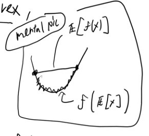

- [Lecture 1: Optimisation 1](#lecture-1-optimisation-1)
  - [Training Loss](#training-loss)
  - [Gradient Descent](#gradient-descent)
  - [Stochastic Gradient Descent](#stochastic-gradient-descent)
- [Lecure 2: Optimisation 2](#lecure-2-optimisation-2)
  - [Stochastic Gradient descent (more)](#stochastic-gradient-descent-more)
  - [Convex Optimisation](#convex-optimisation)
    - [Preliminaries](#preliminaries)
      - [Exercise](#exercise)
    - [Convex Optimisation (really)](#convex-optimisation-really)
  - [Non-convex problems](#non-convex-problems)
    - [Over-parameterization](#over-parameterization)
- [Lecture 3 - Perceptron](#lecture-3---perceptron)
  - [Preliminaries](#preliminaries-1)
  - [Perceptron algorithm](#perceptron-algorithm)
    - [Algorithm](#algorithm)
    - [Theory](#theory)
- [Lecture 4 - Margin SVM](#lecture-4---margin-svm)
  - [Towards Support Vector Machine](#towards-support-vector-machine)
  - [More general SVM](#more-general-svm)
  - [What is Support Vector](#what-is-support-vector)

# Lecture 1: Optimisation 1

- Goal of ML: minimise expected loss when deployed outside of training environment.
- Goal of training: minimize training loss.
  - Note, different from ML! 
  - Training and reality has a gap
- Generalized to: expected loss = training loss + generalisation error
  - generalisation error tends to 0 as training data increases (in terms of diversity and quantity)
  - typically by $O(\sqrt{\frac{1}{N}})$
- Therefore, we focus on minimizing training loss as expected loss approximate to training loss as training points increase

## Training Loss

- minimise training loss $f(\theta)$ where $\theta$ is the parameter of the model, $f(\theta) \in \mathbb{R}$
- typically, $f(\theta) = \frac{1}{N}\sum^{t=1}_n f_t(\theta)$
  - $f_t$ is the training loss for $t$-th data point $t$, $x_t$
  - $f_t(\theta) = l(h_{\theta}(x_t), y_t)$ where:
    - $h_{\theta}(x_t)$ is the predicted output given $x_t$ or output
      - Linear model: $\theta^Tx$ - dot product
    - $y_t$ is the target _vector_
    - $l$ is the function to measure the difference between $h_{\theta}(x_t)$ and $y_t$. Examples of $l$
      - square loss: $l(a,b) = (a-b)^2$
      - cross-entropy loss, etc

## Gradient Descent

- Gradient descent to minimise loss:
  1) initialise $\theta^0$ where $0$ refers to the step count
  2) update $\theta^{k+1} = \theta^k - \alpha \nabla f(\theta^{k})$
     - $\alpha$ - learning rate or step size
     - $\nabla f(\theta^{k})$ - gradient (derivative of $f(\theta)$) of $\theta$, $\theta \in \mathbb{R}^d$
       - Because it's a vector, the differentiation occurs element wise w.r.t to vector element: $\frac{\delta f(\theta)}{\delta \theta_1}, \frac{\delta f(\theta)}{\delta \theta_2} ...$
  - "Step down hill" concept - tends to local minima
- effects of $\alpha$:
  - too high: overshoot and swing around the local minima or worse
  - too low: converge very slow
- Derivation: 
  - why it works
  - Setup: we are at $\theta^k$, we want to move 'down hill', $\theta^k + \epsilon \Delta$ s.t $f(\theta^k + \epsilon \Delta) < f(\theta^k)$ (basically more minmised)
    - $\epsilon$ is small
    - arbitrary $\Delta \in \mathbb{R}^d$ because it must be the same shape as $\theta$ s.t $\Vert \Delta \Vert = 1$
      - Just move towards the direction. Don't care about magnitude, that's what the $\epsilon$ is for.
    - Taylor approximation (first order)
      - $f(\theta^k + \epsilon \Delta) {taylor \atop \approx} f(\theta^k) + \epsilon \nabla f(\theta^k)^T \Delta$
    - minimise by choosing $\Delta$
    - We don't know what $\Delta$ to choose for LHS so we use first order taylor approximation to decide it for us as an approximation
      - Looking at the RHS, $\Delta$ is not dependent on $f(\theta^k)$ so we can ignore it.
      - $\epsilon$ is just a scalar, can be seen as a constant.
      - Therefore:
        - $\underset{\Delta}{argmin}  \nabla f(\theta^k)^T \Delta = \underset{\Delta}{argmin} \Vert \nabla f(\theta^k) \Vert \Vert\Delta\Vert cos(\nabla f(\theta^k), \Delta)$
          - Recall your dot product": $a^Tb = \Vert a \Vert \Vert b \Vert cos(a,b)$
          - $(a,b)$ is the angle between $a$ and $b$
        - $\Vert \nabla f(\theta^k) \Vert$ does not depend on $\Delta$
        - $\Delta$ is a unit vector thus $\Vert\Delta\Vert = 1$
        - We can simplify it to: $\underset{\Delta}{argmin} \nabla f(\theta^k)^T \Delta = \underset{\Delta}{argmin}\ cos(\nabla f(\theta^k), \Delta)$
          - $cos(a,b) \in [-1,1]$, $cos(u)=-1$ is minimised when $u=\pi$
          - Basically it goes opposite of the gradient direction
        - Simplifying it again: $\underset{\Delta}{argmin} \nabla f(\theta^k)^T \Delta = \frac{-\nabla f(\theta^k)}{\Vert \nabla f(\theta^k) \Vert}$
          - We need to normalise, thus dividing by the norm
    - So let's rewind:
      - $\theta^{k+1} = \theta^k + \epsilon \Delta$
      - $\theta^{k+1} = \theta^k - \epsilon \frac{-\nabla f(\theta^k)}{\Vert \nabla f(\theta^k) \Vert}$ (because of the first order approximation we did)
      - $\theta^{k+1} = \theta^k - \alpha \nabla f(\theta^k)$ (let $\alpha = \frac{\epsilon}{\Vert \nabla f(\theta^k) \Vert}$)
      - Viola, this is how we get gradient descent!
  - So under what condition do we see the 'downhill' effect or under what condition is $f(\theta^{k+1}) < f(\theta^k)$
    - step size, $\alpha$ when sufficiently small
    - $\nabla f(\theta^k)  \neq 0$
      - Proof:
        - Let us taylor's theorem.
        - $f(\theta^k + \epsilon \Delta) = f(\theta^k) + \nabla f(\theta^k)^T \Delta + g(\Delta)\Vert \Delta \Vert$ where $\underset{\Delta \rightarrow 0}{lim}\ g(\Delta)=0$
          - as $\Delta \rightarrow 0$, basically, the gradient gets smaller and smaller.
        - Now, let us define:
          - $\Delta =  -\alpha \nabla f(\theta^k)$
          - $\phi(\alpha) = -g(\alpha \nabla f(\theta^k))$
        - We can rewrite it as : $f(\theta^k -\alpha \nabla f(\theta^k)) = f(\theta^k) - \alpha \Vert\nabla f(\theta^k)\Vert^2 +\phi(\alpha)\alpha \Vert \nabla f(\theta^k) \Vert$
        - Group: $f(\theta^k + \epsilon \Delta) =  f(\theta^k) - \alpha \Vert\nabla f(\theta^k)\Vert \ . \  [\Vert \nabla f(\theta^k) \Vert - \phi(\alpha)]$
          - if $\nabla f(\theta^k) \neq 0$ and $\alpha\gt 0$, $\alpha \Vert\nabla f(\theta^k)\Vert > 0$
          - $\alpha$ is small, $[\Vert \nabla f(\theta^k) \Vert - \phi(\alpha)] > 0$
            - There exists $\alpha'$ such that for all $\alpha < \alpha'$, $\phi(\alpha) < \Vert \nabla f(\theta^k) \Vert$ as long as $\nabla f(\theta^k)$ is non-zero
            - Because, $\phi(\alpha)=0$ as $\alpha \rightarrow 0$ due to the defintion of $g$
    - Side note: scientific process: experiement inform hypothesis, maths confirm hypothesis

## Stochastic Gradient Descent

- Gradient descent: $\nabla f(\theta) = f(\theta) = \frac{1}{N}\sum^{t=1}_n \nabla f_t(\theta)$
  - Expensive, need to compute for all $n$ where it could be practically impossible to compute.
- So let's use one data point:
  - update $\theta^{k+1} = \theta^k - \alpha \nabla f_t(\theta^{k})$
  - where $f_t$ is the loss function for $x_t$. $x_t$ can be sampled or gotten sequentially.
    - Good: less computationally expensive
    - Bad: Really long time to converge
- Compromise: Mini-batch SGD
  - $\theta^{k+1} = \theta^k - \alpha [\frac{1}{I} \sum_{i\in I}\nabla f_i(\theta^{k})]$ for index set $I$

# Lecure 2: Optimisation 2

## Stochastic Gradient descent (more)

- Newton method (local search)
- Because it's taylor approximation at current point
- Get stuck at local minimum (we kinda know this)
- Locally it's the best solution but not globally
- Why not global search?
  - We can use grid search or bisection
  - Bayesian optimization using guaissian process
  - But does not scale to high dimensional problem where $\theta \in D$
    - Basically when dimension is huge
    - For example grid search, using 17 points. Scale to $17^d$ (exponentially increase!). Fundamental problem
- Global seach vs local search.
  - Local search: good for scaling, bad because local min (use this for train)
  - global search: good for global min, bad for scaling  (use this for hyperparameter tuning)
- How to avoid local min issue:
  - a family of problem that does not have this issue - convex optimisation
  - If you formulate problem as a convex optimisation, then we can scale well and avoid local min (because there is only one min)
  - For non-convx:
    - over-parameterization
    - skip connection
    - focus on this!

## Convex Optimisation

### Preliminaries

- Convex sets: Let $D \in \mathbb{R}^d$.
  - $D$ is a convex set if $\forall a,b\in D, \lambda a + (1-\lambda)b \in D, \forall \lambda \in [0,1]$
  - For example two points in a circle are in convex set because it's line ($ \lambda a + (1-\lambda)b$) will always be in the the set.
    - Non-convex set: Doughnuts, regular polygon with notches
  - $\lambda a + (1-\lambda)b \in D, \forall \lambda \in [0,1]$ is known as convex combination of $a$ and $b$. 
    - Note, not the same as linear combination ($\lambda _1 a + \lambda_{2} b $)
      - because linear combination covers all the space. Convex combination is a subset of it.
- Convex Function:
  - $f: D\rightarrow \mathbb{R}$ is a convex function for all $a$ and $b$:
    - $f(\lambda a + (1-\lambda)b) \leq \lambda f(a) + (1-\lambda)f(b)$ where $D$ is a convex set 
    - if $D$ is not convex, then LHS is undefined.
    - $f(\lambda a + (1-\lambda)b)$ - defines the function along the line segment between $a$ and $b$.
    - $\lambda f(a) + (1-\lambda)f(b)$ - defines the line segment between $f(a)$ and $f(b)$
    - If $D$ is convex set, then $\lambda f(a) + (1-\lambda)f(b)$ is bounded by $f(\lambda a + (1-\lambda)b)$
    - How do you define this beyond $d>2$?
- Epigraph(f) = $\{ (\theta, \beta) \| f(\theta)\lt\beta\}$
- $f$ is convex iff epigraph(f) is convex (as a set)
  - This allows us to define whether a function is a convex function by using sets. 
  - Every local minimum of $f$ is a global minimum for $f$ if it exists
- Proof that there can only be one global minimum in a convex function $D$
  - Defintition: $\theta$ is local min of $f$ iff $\exists \epsilon >0$ s.t:
    - $f(\theta)\leq f(\hat{\theta})$
    - $\forall\hat{\theta}\in D \cap\beta_{\epsilon}(\theta)$ where 
    - $\beta_{\epsilon}(\theta)=\{\hat{\theta}\vert\ \lvert\lvert \theta - \hat{\theta} \rvert\rvert \leq \epsilon \}$
    - $\beta_{\epsilon}(\theta)$ is basically an interval around $\theta$
      - $\{\hat{\theta}\vert \rvert \theta - \hat{\theta} \lvert \leq \epsilon \}\rightarrow$ this means the range around $\epsilon$
  - Defintition: $\theta$ is a global minimum of $f:D\in\mathbb{R}^d\rightarrow \mathbb{R}$ iff $f(\theta)\leq f(\hat{\theta}),\ \forall \hat{\theta} \in D$
    - Note, the lack of $\beta_{\epsilon}(\theta)$. Basically, we are expanding the definition to the whole of $D$ instead of just the interval.
  - Proof:
    - Let $\theta$ be a local min $f$
    - That means $\exists \epsilon >0$ s.t $\forall \hat{\theta}\in D$
    - $f(\theta)\leq f(\theta + \epsilon(\hat{\theta} - \theta))$ (upper bounded by), this is from the defintion of local minima & convexity of $D$
      - $\epsilon(\hat{\theta} - \theta)$ is basically $\beta_{\epsilon}(\theta)$
    - We simplify this: $f(\theta)\leq f(\epsilon\hat{\theta} + (1-\epsilon) \theta)$
    - assume $f$ is convex: $f(\theta) \leq \epsilon f(\hat{\theta}) + (1-\epsilon)f(\theta)$ 
      - Based on previous definition
    - Rewrite the equation: $f(\theta) - (1-\epsilon)f(\theta) \leq \epsilon f(\hat{\theta})$
    - Reduce the equation: $\epsilon f(\theta) \leq \epsilon f(\hat{\theta})$
    - Remove $\epsilon$, $f(\theta) \leq f(\hat{\theta})$
      - This covers all domain of $D$. And thus, this proves that a convex function has a global minimum
- More examples of convex function
  - $f(z) = \vert\vert z\vert\vert^2$
  - if $f(z)$, $-f(z)$ is also convex
  - $e^2$, $e^{-z}$
  - $log \sum^d_{n=1}e^{z_n}$, $-logz$
  - $-\sqrt{z}$
  - $z^\top{a+b}$ (affine transformation)
- if $f_1...f_L$ are convex functions on D, then so are:
  - $f(\theta) = \sum \lambda_{n} f_n(\theta)$ iff $\lambda_{1}...\lambda_{n} \geq 0$
  - $f(\theta) = max f_n(\theta)$
- if $g$ is a convex function and $h$ is affine, then $f(\theta) = g(h(\theta))$ is also convex. 
  - affine = Linear + offset. $h(\theta) = a^\top\theta+b$
  - Basiically Least square regression or loss is convex
    - $f(\theta) = \frac{1}{n}\sum^n_{t=1}(\theta^\top x_n - y_n)^2$
    - $\theta^\top x_n - y_n$ is convex
    - $(.)^2$ is also affine
    - sum of convex function $\sum^n_{t=1}.$ is also affine
    - thus, least square is affine as long as $1/n$ is positive
- equivalent definition
  - $0^{th}$ order: $f(\lambda a + (1-\lambda)b) \leq \lambda f(a) + (1-\lambda)f(b)$ (without requiring differentiability)
  - $1^{st}$ order: $f(b) \geq f(a) + \nabla f(a)^\top(b-a), \forall a,b$ (it's differentiable)
    - $f(b)$ is convex as long as the inequality hold
    - Let's focus on the RHS: $f(a) + \nabla f(a)^\top(b-a)$
      - Basically, $f(a) + \nabla f(a)^\top(b-a)$ is tangent plane of $f(b)$ and inequality indicates that $f(b)$ will always be above its tangent plane.
      - Provided that it is convex.
    - So if $\nabla f(a)=0$, then $f(b)\geq f(a), \forall b$, value at $a$ is a lower bound
    - if $a$ is a point s.t $\nabla f(a)=0$, then $a$ is a global min, because all $b, f(b)\geq f(a)$
      - This is known as a critical point / stationary point
    - if $f$ is convex and differentiable then every critical point is a global min of $f$
- Importance of convex function beyond optimization
  - Jensen inequality: if $X$ is random variable and $f$ is a convex function:
    - $f(\mathbb{E}[X]) \leq \mathbb{E}[f(X)]$
    - Similar to the idea of 0th order of convex function: $f(\lambda a + (1-\lambda)b) \leq \lambda f(a) + (1-\lambda)f(b)$
    - Mental picture: 
      - 
  - used in variational inference
  - computation / approximation of mutual information theory
  - Theory of DL

#### Exercise

- Exercise 1:08:00?

### Convex Optimisation (really)

- $\underset{\theta}{min}f(\theta)$ w.r.t $\theta$ subject to the following constraints:
  - $f_n(\theta)\leq 0$, $\forall n=1,...,m$ Any theta that causes the $f$ to go below 0 must still be convex
  - $g_n(\theta)=0$, $\forall n=1,...,\hat{m}$
  - Under assumption that $f$ and $f_i$ are convex and $g_i$ is affine
    - Why $g$ is not convex? Beacause it's a line segment, any two points in a line segment that 'curves' cannot be convex
    - This defines a convex set.
    - 1:18 for more elaboration. I am still not buying it.
  - Intersection of convex sets = convex
    - The set of all $\theta$ that satisfies the constraints means intersection is also convex
- This means that it is equvariant to:
  - $\underset{\theta \in D}{min} f(\theta)$ without any constraints $g_i$ and $f_i$ for some convex set $D$
    - As long as $\theta \in D$.
- Big picture of this.
  - Assume we have a non-convex, $\hat{D}$. We can have a situation where we cannot go to the global minimum.
  - But if it's a convex _domain_, we can go for the global minimum.
- **Very, very important comment**:
  - Whatever your real world problem is (economic, sensor, signal processing, etc), once you formulate it as a convex optimization, you can immediately get the solution efficiently by using a solver.
    - Problem with flatness can still be tackled within the problem of convex optimisation
    - Can be a research question
  - As a useful mindset: ask yourself, can you change this into a convex optimisation problem?
    - Typically, you can't but we can convert subset of it to a convex optimisation problem

## Non-convex problems

- So what is non-convex problems?
  - Deep learning, transformation, LoRA training, etc.
  - (S)GD finds local minimum (approximately and randomness)
    - SGD can find it even with randomness (different start, different mini-batch, etc)
    - Good to call as long as local min = global min
- Recall convexity: every local min = global min.
- Can we go beyond convexity? Every local min found by SGD is approximately global min with high probability?
  - It's a weaker guarantee but it's good enough.
  - Can we find this condition? And yes!
  - For example: Over-parameterization and skip-connection, data architecture alignment (necessary and sufficient)

### Over-parameterization

- We focus on this.
- We define parameters of a model, $d >> n$ where n is the number of data points.
- Assumptions:
  1) $f(\theta)=\frac{1}{n}\sum_{y=1}^n l(h_{\theta}(x_i), y_i)$, $n \lt \infin$
     - Objective function is the average loss over $n$ training data points where each sample loss is non-negative.
  2) $l(h_{\theta}(x_i), y_i) = (l_i \circ h_i)(\theta)$. $l_i$ is convex and $h_i$ can be non-convex
     - $l_i(a) = l(a, y_i) \in \mathbb{R}$ 
     - $h(\theta) = h_{\theta}(x_i)\in \mathbb{R}$
     - Most loss functions, $l_i$ are convex i.e. least square, cross entropy, etc.
  - Common loss functions + NN ($h_i$) fulfils both assumptions (i) and (ii). Training is averaging the loss of all data points and loss function is convex.
- Non-convex optimisation is a huge problem due to high dimensionality which creates many local minimum.
  - BUT in deep learning, we are dealing with a specific subset of non-convex optimisation that can arise in machine learning.
  - Can use additional assumptions.
- Definition: $\theta$ is a critical point of $f$ if $\frac{\delta f(\theta)}{\delta \theta}=0$
- Fact: The set of all critical points is a subset of the set of all local mins.
  - Thus if every critical point is a global min, then that means every local min is global min.
- Every crtiical point has a good property and thus, every global min has a good property.
- Let $\theta$ be a critical point, $\theta \in \mathbb{R}^d$
  - therefore $\frac{\delta f(\theta)}{\delta \theta}=0$
  - Now, $\frac{\delta f(\theta)}{\delta \theta}= \frac{1}{n}\sum_{i=1}^n \frac{\delta l_i(h_i(\theta))}{\delta \theta}=0$
    - Gradient of sum = sum of gradient
  - Put 1/n in and use chain-rule on $\delta$:
    - $\sum_{n=1}^n \frac{1}{n} \frac{\delta l_i(h_i(\theta))}{\delta \hat{y_i}} \frac{\delta \hat{y_i}}{\delta \theta}$
    - Where $\hat{y}_i = h_i(\theta) \in \mathbb{R}$
  - Now, we rewrite using matrix product.
    - $v_i\in \mathbb{R} = \frac{1}{n} \frac{\delta l_i(h_i(\theta))}{\delta \hat{y_i}}$, a $1\times 1$ vector
    - $a_i \in \mathbb{R^{1\times d}}$ (low dimension vector because $\theta \in \mathbb{R}^d$)
    - Thus, $V_i \times a_i \in \mathbb{R}^{1\times d}$ 
    - $\sum_{n=1}^n v_i \times a_i$
  - Now using vector product, $a^\top b=\sum a_i . b_i$, we can formulate the equation:
    - $V = [v_1,...,v_n]^\top \in \mathbb{R}^n$
    - $A = [a_1^\top,...,a_1^\top] \in \mathbb{R}^{d\times n}$
    - Therefore $\sum_{n=1}^n v_i \times a_i = V^\top A^\top$
  - This $0=V^\top A^\top$, $AV=0$
- So thus, if $\theta$ is local minimum $\Rrightarrow\theta$ is a critical point $\Rrightarrow Av=0$
- So consider that Av=0 is a matrix.
  - $A \in \mathbb{R}^{d \times n}$
  - $v \in \mathbb{R}^{n \times 1}$
  - $Av \in \mathbb{R}^{d \times 1}$
- And now going back to over-parameterization where $d>>n$, suppose that $rank(A)=n$
  - Defintion of rank in matrix = $\{\bar{v} \in \mathbb{R} \vert A \bar{v} = \{0\}\}$ basically there are values such that  $Av$ is 0 only.
  - Now, since we already have the gradient $Av=0$, this means $v=0$
  - $\forall i=1,..,n$, that means $v_i\ = \frac{1}{n} \frac{\delta l_i(h_i(\theta))}{\delta \hat{y_i}} =0$
  - On the other hand, in common DL, loss function is convex.
    - Thus using first order defintion: $l_i(q_i)\geq l_i(\hat{y}_i) + \frac{\delta l_i(\hat{y_i})}{\delta \hat{y_i}} (q_i = \hat{y}_i)$
      - Tangent line (RHS)is always below the function (LHS) 
  - Now, we know $\frac{\delta l_i(h_i(\theta))}{\delta \hat{y_i}} =0$, 
    - $l_i(q_i)\geq l_i(\hat{y}_i)$
  - Now, equvariantly, $\forall \underset{q_i\in \mathbb{R}}{min}\ l_i(q_i)\geq l_i(\hat{y}_i)$
  - Now we sum up both side of the inequality:
    - $\frac{1}{n} \sum_{n=1}^n \underset{q_i\in \mathbb{R}}{min}\ l_i(q_i)\geq \frac{1}{n} \sum_{n=1}^n l_i(\hat{y}_i)$
    - Your RHS is actually definition of the objective function
    - Your LHS is the lower bound of the objective function for global minimum. LHS: for any potential output of the model, LHS is the minimum value.
    - Whatever model we use, we cannot achieve lower objective function than LHS
  - Thus, $\theta$ is global min for $rank(A)=n$ (without using the convexity of the function, itself!)
  - We need to make sure that $rank(A)=n$, then we are good without convexity.
    - Over-parameterization ensure this.
    - As $d$ increases, $rank(A)$ tends to increase towards $n$
    - We want to ensure linear independency across the data or across $n$, add $d$ to make it happen
    - For example, feed forward network:
      - m = width,
      - if $m\geq n$, easy to make $rank(A)=n$
      - Ref: 
        - Neurips 2016: Deep learning w/o poor local minimum
        - Neurips 2022: Understanding dynamics of nonlinear representation learning.
  - Counter example:
    - Increase $d$ but $rank(A)\neq n$
    - Feedforward network with $m=1$ but $L>>n \rightarrow d>>n$.
    - $rank(A)<<n$ 
- "Skip connection": 2018 NN jorunal: "depth cwith nonlinearity creates no bad local minimum in ResNet"
  - Residual network?
- More references: 2:23

# Lecture 3 - Perceptron

## Preliminaries

- Binary classification: $D = \{(x_t, y_t)\}_{t=1}^n$
  - Dataset $D$ with a pair, 
  - vector, $x_t$ where $x_t\in \mathbb{R}^d$ 
  - label, $y_t$ where $y_t \in \{-1,+1\}$ as binary label
- classification function, $f:\mathbb{R}^d\rightarrow \{-1,+1\}$
- We will focus on linear classification: $f_{\theta}(x\vert sign(\theta^\top x))$
  - where $\theta \in \mathbb{R}^d$, same dimension as input vector
  - $\theta^\top x$ can be written as product of the $\theta$ and $x$, $<\theta, x> = \sum_{i=1}^d \theta_ix_i$
  -  $sign(q)=
      \begin{cases} 
        +1 & \text{if}\ q>0 \\
        -1 & \text{if}\ q<0 \\
        0 & \text{if}\ q=0 \\
      \end{cases}$
  - Intepretation: in a 2D plot, you will have a line where values above it are $+1$ and values below it are $-1$
- Linear classification is basic but they serve as a building block
- It is intepretable because we can track how $x$ changes $f_{\theta}$. 
  - For example, if $\theta_i$ is huge in relative to the entire vector $\theta$ ($\frac{\theta_i}{\Vert \theta \Vert}>>0$) then we know where $x_i$ will lie in the function based on how large is it : ($\frac{x_i}{\Vert x \Vert} >>0 \rightarrow f_{\theta}=+1$)
  - Likewise in the contrary,  ($\frac{\theta_i}{\Vert \theta \Vert}<<0$) means $\frac{x_i}{\Vert x \Vert} >>0 \rightarrow f_{\theta}=-1$
  - If $\frac{\theta_i}{\Vert \theta \Vert}=0$, then that means $x_i$ is not important to the classification.
  - Do note that this is $\theta_i$ which is a component in $\theta$ which corresponds to $x_i$ which can be seen as a feature.

## Perceptron algorithm

- Goal: Minimizing training error as usual, $E^\top(\theta) = \frac{1}{n} \sum_{t=0}^n Loss_{\text{0-1}}(y_t, f{\theta}(x_t))$ where 
  - $Loss_{\text{0-1}}=\begin{cases}
  1 & \text{if}\ \hat{y}\neq y \newline
  0 & \text{otherwise}
  \end{cases}$
  - $y_t$ is the label for $x_t$, either -1 or 1
  - $f_{\theta}(x_t)$ is the output of the classifier ($sign(\theta^{\top}x_t)$)
- Do not consider generalisation. Focus on testing error.
- Assumptions: Data $D$ is linearly separable, basicaly, $D \Leftrightarrow \exist \theta^{*} \in \mathbb{R}^d$ s.t. $y_t = sign(x_t^\top\theta) \ \forall t=1,..,n$
- Decision boundary: $\exists x \vert \theta^\top x =0$
  - $\theta$ can be seen as orthogonal to the decision boundary.
  - Remember, $\theta^\top x$ can be seen as $\Vert\theta\Vert\Vert x\Vert cos(angle(\theta, x))$
    - Also recall, $sign$ only output based on the sign of the $f_{\theta}$, so $\Vert\theta\Vert\Vert x\Vert$ does not matter only $cos(angle(\theta, x)) \in [-1,1]$
    - Thus, $f_{\theta}(x)=+1$ iff $angle(\theta, x) < 90^{\circ}$, $-1$ iff $angle(\theta, x) > 90^{\circ}$, $0$ iff $angle(\theta, x) = 0^{\circ}$
- General idea:
  - Step through $D$, check if $y_t = f_{\theta}(x_t)$
  - if not, 'correct' it by update $\theta_{new} = \theta + x_ty_y$
  - else, don't update.
- Why?
  - When you make a mistake:
    - $y_t \theta^\top x_t \leq 0$
      - This is just a compression of this:
      - $y_t \neq sign(\theta^\top x_t) \Leftrightarrow \begin{cases}
            \theta^\top x_t \leq 0 & \text{means}\ y_t=1 \\
             \theta^\top x_t \geq 0 & \text{means}\ y_t=-1 \
      \end{cases}$
      - Regardless, in order to the same value as $y_t$, $\theta^\top x_t$ must be the same sign as $y_t$ and hence will always be strictly positive. Therfore, the negation of that is $\leq 0$
  - Thus, consider when we make a mistake, we need to update:
    - $\theta_{new} = \theta + x_ty_y$
    - Now, we sub $\theta_{new}$ into the inequality: $y_t \theta^\top x_t$:
      - $y_t \theta_{new}^\top x_t$
      - $y_t (\theta + x_ty_y)^\top x_t$
      - $y_t \theta^\top x_t + y_t^2 x_t^\top x_t$ ($y_t$ is essentially a scalar. $x$ is a vector)
      - $y_t\theta^\top x_t + \Vert x_t \Vert^2$ ($y_t=1$ because it's {-1,1,0}, $x^\top x = \Vert x \Vert^2 = \sqrt(q^{\top}q)$ and therefore, another scalar)
    - Here, we see $y_t\theta^\top x_t$ is the original inequality where it is $\leq 0$ because it was incorrect.
    - $\Vert x_t \Vert^2$ will definitely be $\geq 0$
      - How do we guarantee this? We use the property of norms.
      - We need to make sure $\Vert x_t\Vert \gt 0$
      - This means $x_t \neq 0$ using positive difference of norm ($\Vert q\Vert=0 \Leftrightarrow q=0$)
      - Now, $x_t$ cannot be $0$ because it implies $sign(\theta^{\top} x_t)=0$. This means $D$ is not linearly separable as you cannot match against $y_t = \{-1,1\}$. This violates the linearly separable assumption
    - Therefore, we are making progress, definitely becoming more positive.
- That said, we only do "correction" for one data point, but it can "mess up" other points in $D$
  - But we can prove that eventually everything will be 'corrected'

### Algorithm

1) set $\theta^0=0$, $k=0$, $k$ is to record the number of the mistakes.
2) Repeat:
   1) for $t$ in $1,...,n$ (we call this 1 pass):
      - if $y_t \neq f_{\theta}(x_t)$, update $\theta^{k+1} = \theta^k + y_tx_t$, 
      - Update $k=k+1$
   2) Stop when no mistakes are made for one pass

### Theory

- Assumptions:
  1) $\Vert x_t \Vert \leq R$ where $R > 0$. Basically, your $x$ is bounded by $R$
  2) $\exists \theta^*, \gamma>0 \vert \underset{t\in {1..,n}}{min}\ y_t(\theta^*)^\top x_t \geq \gamma$
     - basically like linearly separable assumption.
     - It's more like the inequality we set before.
     - the $\gamma$ states the degree of separability. Think of it as distance away from decision boundary based on $\frac{\gamma}{\|\theta^*\|}$ (if it's large, data points are further away from decision boundary)
- Theory: Perception terminates after at most $k_{max}$ mistakes with:
  - $k_{max} = R^2 \frac{\|\theta^*\|^2}{\gamma^2}$
  - Basically, if $\frac{\gamma}{\|\theta^*\|}$ is large, then means we make lesser mistakes because the hard margin of decision boundary is so much larger.
  - $\gamma$ and $\|\theta^*\|$ has an inverse relationship.
  - We want to increase $gamma$ and one way to do it is to scale the magnitude of $x_t$ which will increase $\gamma$ (hopefully). 
    - However, we will need to scale $R$ as well but this will cancel each other out.
- Proof in 3 steps:
  1) $(\theta^*)^\top\theta^k \geq ck, \exists c \vert\ c>0$ ($ck$ act as a lower bound)
     - product between two vectors measure how similar (cosine similarity) those vectors are.
     - Basically, we want $\theta^*$ and $\theta^k$ to be of the same direction (minimise the angle) even if the magnitude are different. If the cosine similarity is $\leq 0$, then the inequality will not hold. 
     - As the number of mistakes, $k$ increase, the lower bound increases as well.
     - If the angle is huge, then $\frac{\|\theta^k\|}{\|\theta^*\|}$ must be huge as well to make sure the inequality hold. This is a potential failure which leads to (ii)
  2) $\|\theta^k\|\leq c'k, \forall c'>0$ This is to prevent the magnitude of $\theta^k$ to increase which may perverse (i).
  3) Deduce that $\theta^*$ and $\theta^k$ gets "close" in terms of decision boundary. Close as in cosine similarity
- Actual Proof
  - First we prove the (i) and expand equation using $k+1$: $(\theta^*)^\top\theta^{k+1}$ 
    - $(\theta^*)^\top (\theta^k + x^k_ty^k_t)$ using the original definition of $\theta^k$ outlined in the perception algorithm. $x^k_ty^k_t$ refers to $x_ty_t$ at $k^{th}$ mistake.
    - $(\theta^*)^\top \theta^k + y^k_t (\theta^*)^\top x^k_t$
    - We note the lower bound: 
      - $(\theta^*)^\top \theta^k + y^k_t (\theta^*)^\top x^k_t \geq (\theta^*)^\top \theta^k + \gamma$ 
      - using the assumption ($\exists \theta^*, \gamma>0 \vert \underset{t\in {1..,n}}{min}\ y_t(\theta^*)^\top x_t \geq \gamma$)
    - Now, we can recursively reduce this lower bound:
      - $(\theta^*)^\top \theta^k + \gamma$
      - $(\theta^*)^\top \theta^{k-1} + \gamma + \gamma$
      - $(\theta^*)^\top \theta^{k-2} + \gamma + \gamma + \gamma$
      - $...$
      - $(\theta^*)^\top \theta^{0} + (k+1)\gamma$
    - Because we initialise $\theta^{0}=0$, this is effecitvely:
      - $(k+1)\gamma$
    - Therefore: $(\theta^*)^\top\theta^{k} \geq k\gamma$ thus $c=\gamma$
  - Let's prove (ii)
    - Expand $\|\theta^{k+1}\|^2$ using the perception algorithm update:
      - $\|\theta^{k+1}\|^2$ = $\| (\theta^k + x^k_ty^k_t) \|^2$
    - $\|\theta^k\|^2 + \|x^k_ty^k_t \|^2 + 2y^k_t(\theta^k)^\top x^k_t$
    - We note the upper bound:
      - $\|\theta^{k+1}\|^2 \geq \|\theta^k\|^2 + \|x^k_ty^k_t \|^2$
      - Because $y^k_t(\theta^k)^\top x^k_t$ is a mistake, we know it's less than or equal to 0 and 0 is the upper bound
    - $\|\theta^k\|^2 + \|x^k_t \|^2$
      - Because $(y_t^k)^2$ is always 1
    - $\|\theta^k\|^2 + R^2$
      - Because the upper bound for $x_t$ is $R$
    - Now we can recursively reduce $\|\theta^k\|^2$
      - $\|\theta^{k-1}\|^2 + R^2 + R^2$
      - $\|\theta^{k-2}\|^2 + R^2 + R^2 + R^2$
      - $...$
      - $(k+1)R^2$
    - Therefore $\|\theta^{k}\|^2 \leq kR^2 \rightarrow \|\theta^{k}\| \leq \sqrt{k}R$, which satisfies the second step where $c'=\sqrt{k}$
  - Recall the original premise. We want to see the mathematical condition that allows $\theta^*$ and $\theta^k$ to be as closed to each other as possible: $cos(angle(\theta^k, \theta^*)) \gt 0$
    - We can rewrite the equation using cosine similarity:
      - $\frac{(\theta^*)^\top\theta^k}{\|\theta^*\|\|\theta^k\|} > 0$
    - Using what we have deduced so far:
      - $\frac{(\theta^*)^\top\theta^k}{\|\theta^*\|\|\theta^k\|} \geq \frac{k\gamma}{\|\theta^*\|\sqrt{k}R}$
      - $\frac{\sqrt{k}\gamma}{\|\theta^*\|R}$
    - Let's rewrite the cosine similarity:
      - $1 \geq \frac{(\theta^*)^\top\theta^k}{\|\theta^*\|\|\theta^k\|}$ of which the original inequality still hold.
      - $1 \geq \frac{\sqrt{k}\gamma}{\|\theta^*\|R}$
    - Solve for $k$
      - $\frac{\|\theta^*\|R}{\gamma} \geq \sqrt{k}$
      - $\sqrt{k} \leq \frac{\|\theta^*\|R}{\gamma}$
      - $k \leq \frac{\|\theta^*\|^2R^2}{\gamma^2}$
    - Thus, we have upper bound for $k$
- Now let's analyze this for a bit: $k \leq \frac{\|\theta^*\|^2R^2}{\gamma^2}$
  - It's independent of $n$ <- size does not matter! Increasing $n$ may not increase $k$
  - But because it's independent, $k>>n$
  - Computation cost is not independent of $n$ as you still have to iterate through $n$
  - As $n$ increases, $\gamma$ will change (or tends to increase?)
  - For $d$, parameters of the model. $d$ increases linearly with $k$ because of $R$ and $\|\theta^*\|$
    - $\|\theta^*\| = \sum^d_{i=1} \theta_i$
- Note about $\frac{(\theta^*)^\top\theta^k}{\|\theta^*\|\|\theta^k\|} > 0$
  - You need to make sure $\|\theta^*\|\|\theta^k\| \neq 0$
  - Assumption of linearly seperability, means $\theta^* \neq 0$:
    -  $y_t (\theta^*)^\top x_t \gt 0$
    -  PD for norm means the norm of any vector is greater than 0
   -  $\forall k\gt 1, \theta^k \neq 0$
      - Because we have established that $(\theta^*)^\top\theta^k \geq ck$ and $c>0$
      - Since we have established that $\theta^* \neq 0$, that means $\theta^k\neq 0$ for the inequality to hold. 
  
# Lecture 4 - Margin SVM

## Towards Support Vector Machine
- Previously we learn about linear classification
- In order to learn, we would like to minimise the number of mistakes, $k$.
- $k$ is depends on $\gamma$, $R$ and $d$
  - We learn that we cannot increase $R$ without increasing $\gamma$.
  - Decreasing $d$ works as well but intuitively, you may lose 'expressivity' / 'flexibility'.
  - Another way is to incresae $\gamma$ which is what we will be focusing on. 
- We would like to maximise $\gamma$ in order to minimise the number of mistakes.
  - $\underset{\gamma}{argmax}\ y_t(\theta^*)^\top x_t \geq \gamma\ \forall t=1,...,n$
  - equvalent to $\gamma = \underset{t=1,...,n}{min} y_t(\theta^*)^\top x_t$
    - Basically, you want to find the maximum $\gamma$ that the linaer classification can work on all of its examples (basically no mistakes)
    - This in turn, $\gamma$ needs to be the minimum for all of its values in $x_t, y_t$?
- Claim: for any $\theta$ separating $+1$ and $-1$, $\gamma_{geom} = \frac{\gamma}{\Vert \theta\Vert}$ is the the smallest distance from any $x_t$ to the decision boundary. $geom$ here means geometric margin.
  - Infinitely possible $\theta$ that can separate the data points.
  - Proof $\frac{y_t\theta^\top x_t}{\|\theta\|}$ is distance from $x_t$ to decision boundary $\theta$
  - Rememeber  $\gamma = \underset{t=1,...,n}{min} y_t(\theta^*)^\top x_t$, if we can prove that $\frac{y_t\theta^\top x_t}{\|\theta\|}$ is the distance of $x_t$ to the decision boundary, then we can solve $\gamma$
  - Proof that the distance is indeed $\frac{y_t\theta^\top x_t}{\|\theta\|}$. Let's define $z_t = x_t - y_ts\frac{\theta}{\|\theta\|}$ 
    - $\frac{\theta}{\|\theta\|}$: the direction from the decision boundary to $x_t$
    - $s$: a scalar to represent the magnitiude or actual distance. This cannot be too small or too big else it will undershoot or overshoot.
    - $y_t$: this is the actual label which is used to control how to move x_t to the decision boundary. If $x_t$ is $+1$, then it moves towards the _opposite_ direction because of $-y_t = -1$ and vice versa.
    - We need to choose $s$ s.t it is exactly on the boundary.
    - Thus, we can write it as such: $\theta^\top z_t=0$
      - Remember cosine similarity? 
    - Now we add $y_t\theta^\top z_t=0$
    - Sub $z_t$: $y_t\theta^\top (x_t - y_ts\frac{\theta}{\|\theta\|})=0$
      - $y_t\theta^\top x_t - y_t^2s\frac{\theta^\top\theta}{\|\theta\|} = 0$
    - Now simplify: $y_t\theta^\top x_t - s \|\theta\| = 0$
      - Because $y_t^2$ is basically $1$
      - and $\theta^\top\theta=\|\theta\|^2$
    - $y_t\theta^\top x_t = s \|\theta\|$
    - $s = \frac{y_t\theta^\top x_t}{\|\theta\|}$
      - Viola, we have proven it.
  - Now remember $k_{max} \leq \frac{R^2\|\theta^*\|^2}{\gamma^2} = \frac{R^2}{\gamma_{geom}^2}$
    - Because of the definition of $\gamma_{geom}$
    - Lower $\gamma_{geom}$ make it harder. Bigger allow smaller number of mistakes.
- Question: does the distance, $\gamma_{geom}=\frac{\gamma}{\|\theta\|}$ depends on $\|\theta\|$?
  - Strangely no. The decision boundary is more dependent on the _direction_ of $\theta$ not the norm (magnitude)
  - Stricly, because of $sign(\theta^\top x)$ which depends on the cosine similarity between $\theta$ and  $x$
  - But the $\gamma_{geom}$ still depends on $\|\theta\|$ 
  - Let's expand accordingly: $\gamma_{geom}=\frac{\gamma}{\|\theta\|}$
    - $\frac{\gamma}{\|\theta\|} = \frac{\underset{t}{min}\ y_t\theta^\top x_t}{\|\theta\|}$
    - Now we apply cosine similarity again: $\frac{\underset{t}{min}\ y_t \|\theta\| \|x_t\| cos(angle(\theta,x_t))}{\|\theta\|}$
    - Bring $\|\theta\|$ out and remove cancel out:$\underset{t}{min}\ y_t  \|x_t\| cos(angle(\theta,x_t))$ 
      - This means that $\gamma$ already incorporate $\|\theta\|$ and thus does not depend on it.
      - Consider that $cos(angle(\theta,x_t)=[-1,1]$
      - If  $cos(angle(\theta,x_t)\approx 0$ (very, near) then we can see that $\gamma_{geom}$ will be very small for. If $y_t=-1$, the cosine similarity will be negative too (going away from $\theta$) and thus, $\gamma_{geom}$ will be small and positive too.
- Now, we wish to find $\theta$ such that $\gamma_{geom}$ is as large as possible.
  - Maximsing $\gamma_{geom}$ is more robust against noise because the decision margin is large.
  - Generalisationfor future points
  - Formalisation: $\underset{\theta, \gamma>0}{max}\ \frac{\gamma}{\|\theta\|}$ s.t $y_t\theta^\top x_t \geq \gamma, \forall t=1,...,n$
  - Change this to a minimization problem: $\underset{\theta, \gamma>0}{min}\ \frac{\|\theta\|}{\gamma}$ s.t $y_t\theta^\top x_t \geq \gamma, \forall t=1,...,n$
  - Now we divide $\gamma$ on the constraint: 
    - $y_t\theta^\top x_t \geq \gamma$
    -  $y_t(\frac{\theta}{\gamma})^\top x_t \geq 1$
    -  So we have: $\underset{\theta, \gamma>0}{min}\ \frac{\|\theta\|}{\gamma}$ s.t $y_t(\frac{\theta}{\gamma})^\top x_t \geq 1 \forall t=1,...,n$
  - Since $\gamma$ is a scalar, we merge it with norm:
    - $\underset{\theta, \gamma>0}{min}\ \|\frac{\theta}{\gamma}\|$ s.t $y_t(\frac{\theta}{\gamma})^\top x_t \geq 1 \forall t=1,...,n$   
  - Solving for mutivariable is a pain (and also typing it), let $\tilde{\theta} = \frac{\theta}{\gamma}$, we have:
    - $\underset{\theta, \gamma>0}{min}\ \|\tilde{\theta}\|$ s.t $y_t\tilde{\theta}^\top x_t \geq 1 \forall t=1,...,n$
  - Now we make it more differentiable by squaring the function, it does not change the minimization function:
    - $\underset{theta, \gamma>0}{min}\ \frac{1}{2}\|\tilde{\theta}\|^2$ s.t $y_t\tilde{\theta}^\top x_t \geq 1 \forall t=1,...,n$ 
    - $\|\tilde{\theta}\|$ is an absolute function, not smmoth at all. Squaring it make it into a quadratic function.
  - This is a special case of support vector machine with hard constraints and no offset.
- Claim: for any linearly separable D, solving the optimization returns $\tilde{\theta}$ with the highest margin with margin = $\frac{1}{\|\tilde{\theta}\|}$
  - margin is defined as such because we are minimising  $\tilde{\theta}$. Once we find the minimum, we are maximising $\frac{1}{\tilde{\theta}}$ because of our transformation above.
  - So why? Because the initial problem while solvable does not behave nice (basically a pain in the ass to solve)
  - Transforming it into a SVM make it into a convex optimisation problem!
    -  $\underset{theta, \gamma>0}{min}\ \frac{1}{2}\|\tilde{\theta}\|^2$ is a convex function because it's quadratic. 
    -   $y_t\tilde{\theta}^\top x_t \geq 1 \forall t=1,...,n$ is an affine function on the domain. (need to change `Lecture 2` for this.)
    - Convex optimisation - you have a convex function with a affine domain!
-  Question: what if $D$ is non-linearly separable?
   -  the optimisation problem will fail. Strictly, infeasible.
   -  Basically, there can be no $\tilde{\theta}$ that satsifies the constraint: $y_t\tilde{\theta}^\top x_t \geq 1 \forall t=1,...,n$
   -  Remember that the constraint indicates that $\theta$ can make no mistakes and that constraint is under the assumption of linear separability.
   -  If the constraint is violated, then the whole thing becomes infeasible.
   -  Question: how to square this away with real world problem? Simple: Assume the the data is linearly seperable!!

## More general SVM

- Linear classification with offset
- $f(x) = sign(\theta^\top x + \theta_{0})$
  - We are gonna learn $\theta$ and $\theta_0$ from $D$
  - We can maximise margin more and therefore better against input robustness and generalisation.
  - Some properties:
    - Offset also helps with the $x_t=0$ problem because $sign(\theta^\top x) = 0$, however with offset, it becomes $sign(\theta^\top x + \theta_0) = sign(\theta_0)=0$
    - Adding offset does not change the direction of $\theta$, it's perpendicular to decision boundary.
- Calculating margin: $\frac{\underset{t}{min}\ y_t(\theta^\top x_t + \theta_0)}{\|\theta\|} = \gamma_{geom}$
  - using the same constraints: $y_t(\theta^\top x_t + \theta_0) \geq \gamma$
  - shortest path from any $x_t$ is still the shortest distance from $\theta$: $x_t - y_ts\frac{\theta}{\|\theta\|}$.
    - Note: no $\theta_0$ because this not depend on the offset. 
- Now maximising the margin, $\gamma_{geom}$ which after the same long ardous process:
  - $\underset{\theta, \theta_0}{min}\ \frac{1}{2}\|\theta\|^2$ s.t $y_t(\theta^\top x_t + \theta_0) \geq 1 \forall t=1,...,n$ 
  - again $\theta_0$ does not appear on the objective function because during the derivation, the objective function does is derived from the distance.
- We can include $\theta_0$ if we re-parametize: 
  - $\tilde{x} = \begin{bmatrix} x \\
  1
  \end{bmatrix}$ and $\tilde{\theta}=\begin{bmatrix}\theta \\ \theta_0\end{bmatrix}$
  - Then $sign(\theta^\top x + \theta_0) = sign(\tilde{\theta}^\top \tilde{x})$
  - Therefore this offset model becomes one without offset.
  - Then we apply it as usual.
  - This is tempting but we will need to minimise $\theta_0$ as well: $|\tilde{\theta}\|^2 \rightarrow |\theta\|^2 + \theta_0^2$
  - What will happen is this penalises the decision boundary to be as close to origin $\rightarrow$ unneccessary optimisation?
  - We regularise the $\theta$ but not the offset.
  - Soemtime, it is okay but it depends but in this case based on our geometric defintion, it may not be wise.
- Question: 1:38:30

## What is Support Vector

- We have a decision boundary, margin, and data points.
- Some data points will be on the edge of the margin. These data points are **support vectors**.
- Data points not on the margin, are not support vectors.
- Claim: If we define a new dataset, $D'$ where it only contains all support vectors from $D$, we get the same _solution_
  - Implication: We know which points are important, intepretability
  - Compression: your model will only need to contain support vectors. 
    - This also affect generalisation as lower points =  better generalisation.
    - There is also generalisation bound that depends on compression.
