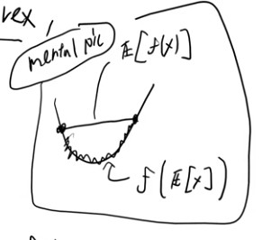
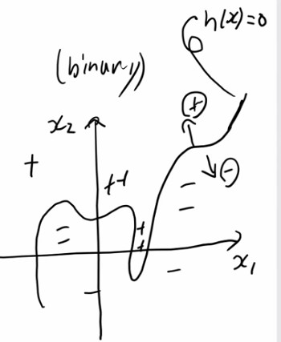
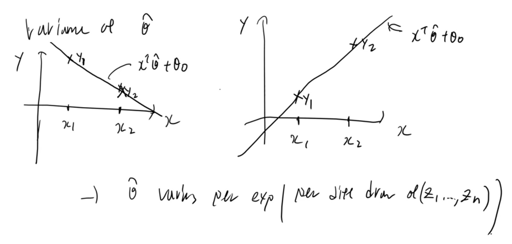
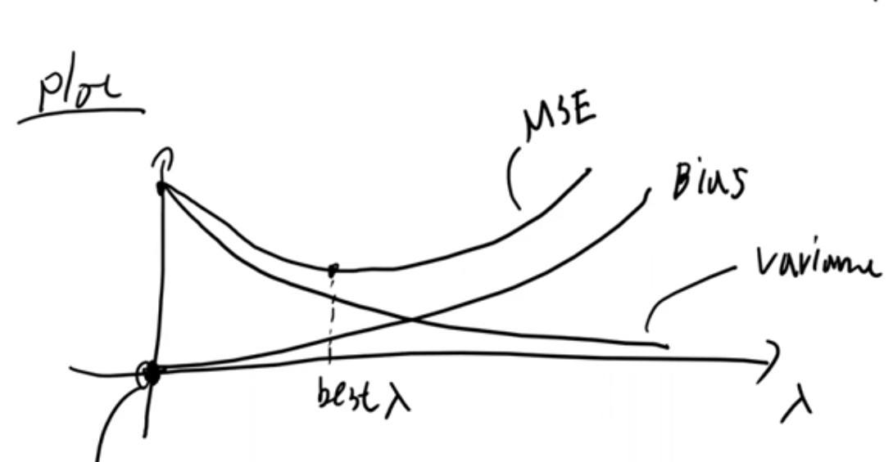
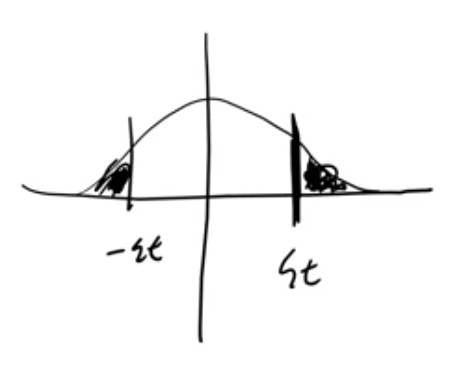
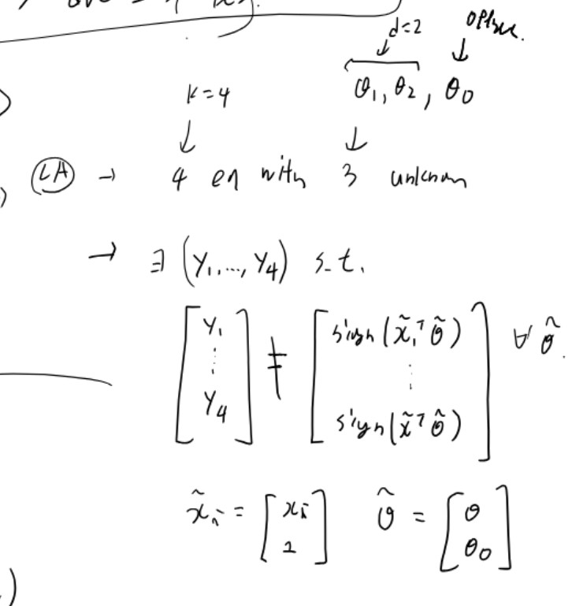

# Lecture 1: Optimisation 1

- Goal of ML: minimise expected loss when deployed outside of training environment.
- Goal of training: minimize training loss.
  - Note, different from ML! 
  - Training and reality has a gap
- Generalized to: expected loss = training loss + generalisation error
  - generalisation error tends to 0 as training data increases (in terms of diversity and quantity)
  - typically by $O(\sqrt{\frac{1}{N}})$
- Therefore, we focus on minimizing training loss as expected loss approximate to training loss as training points increase

## Training Loss

- minimise training loss $f(\theta)$ where $\theta$ is the parameter of the model, $f(\theta) \in \mathbb{R}$
- typically, $f(\theta) = \frac{1}{N}\sum^{t=1}_n f_t(\theta)$
  - $f_t$ is the training loss for $t$-th data point $t$, $x_t$
  - $f_t(\theta) = l(h_{\theta}(x_t), y_t)$ where:
    - $h_{\theta}(x_t)$ is the predicted output given $x_t$ or output
      - Linear model: $\theta^Tx$ - dot product
    - $y_t$ is the target _vector_
    - $l$ is the function to measure the difference between $h_{\theta}(x_t)$ and $y_t$. Examples of $l$
      - square loss: $l(a,b) = (a-b)^2$
      - cross-entropy loss, etc

## Gradient Descent

- Gradient descent to minimise loss:
  1) initialise $\theta^0$ where $0$ refers to the step count
  2) update $\theta^{k+1} = \theta^k - \alpha \nabla f(\theta^{k})$
     - $\alpha$ - learning rate or step size
     - $\nabla f(\theta^{k})$ - gradient (derivative of $f(\theta)$) of $\theta$, $\theta \in \mathbb{R}^d$
       - Because it's a vector, the differentiation occurs element wise w.r.t to vector element: $\frac{\delta f(\theta)}{\delta \theta_1}, \frac{\delta f(\theta)}{\delta \theta_2} ...$
  - "Step down hill" concept - tends to local minima
- effects of $\alpha$:
  - too high: overshoot and swing around the local minima or worse
  - too low: converge very slow
- Derivation: 
  - why it works
  - Setup: we are at $\theta^k$, we want to move 'down hill', $\theta^k + \epsilon \Delta$ s.t $f(\theta^k + \epsilon \Delta) < f(\theta^k)$ (basically more minmised)
    - $\epsilon$ is small
    - arbitrary $\Delta \in \mathbb{R}^d$ because it must be the same shape as $\theta$ s.t $\Vert \Delta \Vert = 1$
      - Just move towards the direction. Don't care about magnitude, that's what the $\epsilon$ is for.
    - Taylor approximation (first order)
      - $f(\theta^k + \epsilon \Delta) {taylor \atop \approx} f(\theta^k) + \epsilon \nabla f(\theta^k)^T \Delta$
    - minimise by choosing $\Delta$
    - We don't know what $\Delta$ to choose for LHS so we use first order taylor approximation to decide it for us as an approximation
      - Looking at the RHS, $\Delta$ is not dependent on $f(\theta^k)$ so we can ignore it.
      - $\epsilon$ is just a scalar, can be seen as a constant.
      - Therefore:
        - $\underset{\Delta}{argmin}  \nabla f(\theta^k)^T \Delta = \underset{\Delta}{argmin} \Vert \nabla f(\theta^k) \Vert \Vert\Delta\Vert cos(\nabla f(\theta^k), \Delta)$
          - Recall your dot product": $a^Tb = \Vert a \Vert \Vert b \Vert cos(a,b)$
          - $(a,b)$ is the angle between $a$ and $b$
        - $\Vert \nabla f(\theta^k) \Vert$ does not depend on $\Delta$
        - $\Delta$ is a unit vector thus $\Vert\Delta\Vert = 1$
        - We can simplify it to: $\underset{\Delta}{argmin} \nabla f(\theta^k)^T \Delta = \underset{\Delta}{argmin}\ cos(\nabla f(\theta^k), \Delta)$
          - $cos(a,b) \in [-1,1]$, $cos(u)=-1$ is minimised when $u=\pi$
          - Basically it goes opposite of the gradient direction
        - Simplifying it again: $\underset{\Delta}{argmin} \nabla f(\theta^k)^T \Delta = \frac{-\nabla f(\theta^k)}{\Vert \nabla f(\theta^k) \Vert}$
          - We need to normalise, thus dividing by the norm
    - So let's rewind:
      - $\theta^{k+1} = \theta^k + \epsilon \Delta$
      - $\theta^{k+1} = \theta^k - \epsilon \frac{-\nabla f(\theta^k)}{\Vert \nabla f(\theta^k) \Vert}$ (because of the first order approximation we did)
      - $\theta^{k+1} = \theta^k - \alpha \nabla f(\theta^k)$ (let $\alpha = \frac{\epsilon}{\Vert \nabla f(\theta^k) \Vert}$)
      - Viola, this is how we get gradient descent!
  - So under what condition do we see the 'downhill' effect or under what condition is $f(\theta^{k+1}) < f(\theta^k)$
    - step size, $\alpha$ when sufficiently small
    - $\nabla f(\theta^k)  \neq 0$
      - Proof:
        - Let us taylor's theorem.
        - $f(\theta^k + \epsilon \Delta) = f(\theta^k) + \nabla f(\theta^k)^T \Delta + g(\Delta)\Vert \Delta \Vert$ where $\underset{\Delta \rightarrow 0}{lim}\ g(\Delta)=0$
          - as $\Delta \rightarrow 0$, basically, the gradient gets smaller and smaller.
        - Now, let us define:
          - $\Delta =  -\alpha \nabla f(\theta^k)$
          - $\phi(\alpha) = -g(\alpha \nabla f(\theta^k))$
        - We can rewrite it as : $f(\theta^k -\alpha \nabla f(\theta^k)) = f(\theta^k) - \alpha \Vert\nabla f(\theta^k)\Vert^2 +\phi(\alpha)\alpha \Vert \nabla f(\theta^k) \Vert$
        - Group: $f(\theta^k + \epsilon \Delta) =  f(\theta^k) - \alpha \Vert\nabla f(\theta^k)\Vert \ . \  [\Vert \nabla f(\theta^k) \Vert - \phi(\alpha)]$
          - if $\nabla f(\theta^k) \neq 0$ and $\alpha\gt 0$, $\alpha \Vert\nabla f(\theta^k)\Vert > 0$
          - $\alpha$ is small, $[\Vert \nabla f(\theta^k) \Vert - \phi(\alpha)] > 0$
            - There exists $\alpha'$ such that for all $\alpha < \alpha'$, $\phi(\alpha) < \Vert \nabla f(\theta^k) \Vert$ as long as $\nabla f(\theta^k)$ is non-zero
            - Because, $\phi(\alpha)=0$ as $\alpha \rightarrow 0$ due to the defintion of $g$
    - Side note: scientific process: experiement inform hypothesis, maths confirm hypothesis

## Stochastic Gradient Descent

- Gradient descent: $\nabla f(\theta) = f(\theta) = \frac{1}{N}\sum^{t=1}_n \nabla f_t(\theta)$
  - Expensive, need to compute for all $n$ where it could be practically impossible to compute.
- So let's use one data point:
  - update $\theta^{k+1} = \theta^k - \alpha \nabla f_t(\theta^{k})$
  - where $f_t$ is the loss function for $x_t$. $x_t$ can be sampled or gotten sequentially.
    - Good: less computationally expensive
    - Bad: Really long time to converge
- Compromise: Mini-batch SGD
  - $\theta^{k+1} = \theta^k - \alpha [\frac{1}{I} \sum_{i\in I}\nabla f_i(\theta^{k})]$ for index set $I$

# Lecure 2: Optimisation 2

## Stochastic Gradient descent (more)

- Newton method (local search)
- Because it's taylor approximation at current point
- Get stuck at local minimum (we kinda know this)
- Locally it's the best solution but not globally
- Why not global search?
  - We can use grid search or bisection
  - Bayesian optimization using guaissian process
  - But does not scale to high dimensional problem where $\theta \in D$
    - Basically when dimension is huge
    - For example grid search, using 17 points. Scale to $17^d$ (exponentially increase!). Fundamental problem
- Global seach vs local search.
  - Local search: good for scaling, bad because local min (use this for train)
  - global search: good for global min, bad for scaling  (use this for hyperparameter tuning)
- How to avoid local min issue:
  - a family of problem that does not have this issue - convex optimisation
  - If you formulate problem as a convex optimisation, then we can scale well and avoid local min (because there is only one min)
  - For non-convx:
    - over-parameterization
    - skip connection
    - focus on this!

## Convex Optimisation

### Preliminaries

- Convex sets: Let $D \in \mathbb{R}^d$.
  - $D$ is a convex set if $\forall a,b\in D, \lambda a + (1-\lambda)b \in D, \forall \lambda \in [0,1]$
  - For example two points in a circle are in convex set because it's line ($\lambda a + (1-\lambda)b$) will always be in the the set.
    - Non-convex set: Doughnuts, regular polygon with notches
  - $\lambda a + (1-\lambda)b \in D, \forall \lambda \in [0,1]$ is known as convex combination of $a$ and $b$. 
    - Note, not the same as linear combination ($\lambda _1 a + \lambda_{2} b$)
      - because linear combination covers all the space. Convex combination is a subset of it.
- Convex Function:
  - $f: D\rightarrow \mathbb{R}$ is a convex function for all $a$ and $b$:
    - $f(\lambda a + (1-\lambda)b) \leq \lambda f(a) + (1-\lambda)f(b)$ where $D$ is a convex set 
    - if $D$ is not convex, then LHS is undefined.
    - $f(\lambda a + (1-\lambda)b)$ - defines the function along the line segment between $a$ and $b$.
    - $\lambda f(a) + (1-\lambda)f(b)$ - defines the line segment between $f(a)$ and $f(b)$
    - If $D$ is convex set, then $\lambda f(a) + (1-\lambda)f(b)$ is bounded by $f(\lambda a + (1-\lambda)b)$
    - How do you define this beyond $d>2$?
- Epigraph(f) = $\{ (\theta, \beta) \| f(\theta)\lt\beta\}$ - all points in $f(\theta)$ is within the convex set
- $f$ is convex iff epigraph(f) is convex (as a set)
  - This allows us to define whether a function is a convex function by using sets. 
  - Every local minimum of $f$ is a global minimum for $f$ if it exists
- Proof that there can only be one global minimum in a convex function $D$
  - Defintition: $\theta$ is local min of $f$ iff $\exists \epsilon >0$ s.t:
    - $f(\theta)\leq f(\hat{\theta})$
    - $\forall\hat{\theta}\in D \cap\beta_{\epsilon}(\theta)$ where 
    - $\beta_{\epsilon}(\theta)=\{\hat{\theta}\vert\ \lvert\lvert \theta - \hat{\theta} \rvert\rvert \leq \epsilon \}$
    - $\beta_{\epsilon}(\theta)$ is basically an interval around $\theta$
      - $\{\hat{\theta}\vert \rvert \theta - \hat{\theta} \lvert \leq \epsilon \}\rightarrow$ this means the range around $\epsilon$
  - Defintition: $\theta$ is a global minimum of $f:D\in\mathbb{R}^d\rightarrow \mathbb{R}$ iff $f(\theta)\leq f(\hat{\theta}),\ \forall \hat{\theta} \in D$
    - Note, the lack of $\beta_{\epsilon}(\theta)$. Basically, we are expanding the definition to the whole of $D$ instead of just the interval.
  - Proof:
    - Let $\theta$ be a local min $f$
    - That means $\exists \epsilon >0$ s.t $\forall \hat{\theta}\in D$
    - $f(\theta)\leq f(\theta + \epsilon(\hat{\theta} - \theta))$ (upper bounded by), this is from the defintion of local minima & convexity of $D$
      - $\epsilon(\hat{\theta} - \theta)$ is basically $\beta_{\epsilon}(\theta)$
    - We simplify this: $f(\theta)\leq f(\epsilon\hat{\theta} + (1-\epsilon) \theta)$
    - assume $f$ is convex: $f(\theta) \leq \epsilon f(\hat{\theta}) + (1-\epsilon)f(\theta)$ 
      - Based on previous definition
    - Rewrite the equation: $f(\theta) - (1-\epsilon)f(\theta) \leq \epsilon f(\hat{\theta})$
    - Reduce the equation: $\epsilon f(\theta) \leq \epsilon f(\hat{\theta})$
    - Remove $\epsilon$, $f(\theta) \leq f(\hat{\theta})$
      - This covers all domain of $D$. And thus, this proves that a convex function has a global minimum
- More examples of convex function
  - $f(z) = \vert\vert z\vert\vert^2$
  - if $f(z)$, $-f(z)$ is also convex
  - $e^2$, $e^{-z}$
  - $log \sum^d_{n=1}e^{z_n}$, $-logz$
  - $-\sqrt{z}$
  - $z^\top{a+b}$ (affine transformation)
- if $f_1...f_L$ are convex functions on D, then so are:
  - $f(\theta) = \sum \lambda_{n} f_n(\theta)$ iff $\lambda_{1}...\lambda_{n} \geq 0$
  - $f(\theta) = max f_n(\theta)$
- if $g$ is a convex function and $h$ is affine, then $f(\theta) = g(h(\theta))$ is also convex. 
  - affine = Linear + offset. $h(\theta) = a^\top\theta+b$
  - Basiically Least square regression or loss is convex
    - $f(\theta) = \frac{1}{n}\sum^n_{t=1}(\theta^\top x_n - y_n)^2$
    - $\theta^\top x_n - y_n$ is convex
    - $(.)^2$ is also affine
    - sum of convex function $\sum^n_{t=1}.$ is also affine
    - thus, least square is affine as long as $1/n$ is positive
- equivalent definition
  - $0^{th}$ order: $f(\lambda a + (1-\lambda)b) \leq \lambda f(a) + (1-\lambda)f(b)$ (without requiring differentiability)
  - $1^{st}$ order: $f(b) \geq f(a) + \nabla f(a)^\top(b-a), \forall a,b$ (it's differentiable)
    - $f(b)$ is convex as long as the inequality hold
    - Let's focus on the RHS: $f(a) + \nabla f(a)^\top(b-a)$
      - Basically, $f(a) + \nabla f(a)^\top(b-a)$ is tangent plane of $f(b)$ and inequality indicates that $f(b)$ will always be above its tangent plane.
      - Provided that it is convex.
    - So if $\nabla f(a)=0$, then $f(b)\geq f(a), \forall b$, value at $a$ is a lower bound
    - if $a$ is a point s.t $\nabla f(a)=0$, then $a$ is a global min, because all $b, f(b)\geq f(a)$
      - This is known as a critical point / stationary point
    - if $f$ is convex and differentiable then every critical point is a global min of $f$
- Importance of convex function beyond optimization
  - Jensen inequality: if $X$ is random variable and $f$ is a convex function:
    - $f(\mathbb{E}[X]) \leq \mathbb{E}[f(X)]$ 
      - Or $f(\mathbb{E}[X]) \geq \mathbb{E}[f(X)]$ if $f$ is _concave_ . $f$ is concave if $-f$ is convex
    - Similar to the idea of 0th order of convex function: $f(\lambda a + (1-\lambda)b) \leq \lambda f(a) + (1-\lambda)f(b)$
    - Mental picture: 
      - 
  - used in variational inference
  - computation / approximation of mutual information theory
  - Theory of DL

#### Exercise

- Exercise 1:08:00?

### Convex Optimisation (really)

- $\underset{\theta}{min}f(\theta)$ w.r.t $\theta$ (global minimum?) subject to the following constraints:
  - $f_n(\theta)\leq 0$, $\forall n=1,...,m$ Any theta that causes the $f$ to go below 0 must still be convex
  - $g_n(\theta)=0$, $\forall n=1,...,\hat{m}$
  - $f_n(g_n(\theta))$ is a convex function provided...
  - Under assumption that $f$ and $f_i$ are convex and $g_i$ is affine
    - Why $g$ is not convex? Beacause it's a line segment, any two points in a line segment that 'curves' cannot be convex
    - This defines a convex set.
    - 1:18 for more elaboration. I am still not buying it.
  - Intersection of convex sets = convex
    - The set of all $\theta$ that satisfies the constraints means intersection is also convex
- This means that it is equvariant to:
  - $\underset{\theta \in D}{min} f(\theta)$ without any constraints $g_i$ and $f_i$ for some convex set $D$
    - As long as $\theta \in D$.
- Big picture of this.
  - Assume we have a non-convex, $\hat{D}$. We can have a situation where we cannot go to the global minimum.
  - But if it's a convex _domain_, we can go for the global minimum. Basically the set of inputs are convex.
- **Very, very important comment**:
  - Whatever your real world problem is (economic, sensor, signal processing, etc), once you formulate it as a convex optimization, you can immediately get the solution efficiently by using a solver.
    - Problem with flatness can still be tackled within the problem of convex optimisation
    - Can be a research question
  - As a useful mindset: ask yourself, can you change this into a convex optimisation problem?
    - Typically, you can't but we can convert subset of it to a convex optimisation problem

## Non-convex problems (not for exam)

- So what is non-convex problems?
  - Deep learning, transformation, LoRA training, etc.
  - (S)GD finds local minimum (approximately and randomness)
    - SGD can find it even with randomness (different start, different mini-batch, etc)
    - Good to call as long as local min = global min
- Recall convexity: every local min = global min.
- Can we go beyond convexity? Every local min found by SGD is approximately global min with high probability?
  - It's a weaker guarantee but it's good enough.
  - Can we find this condition? And yes!
  - For example: Over-parameterization and skip-connection, data architecture alignment (necessary and sufficient)

### Over-parameterization

- We focus on this.
- We define parameters of a model, $d >> n$ where n is the number of data points.
- Assumptions:
  1) $f(\theta)=\frac{1}{n}\sum_{y=1}^n l(h_{\theta}(x_i), y_i)$, $n \lt \infin$
     - Objective function is the average loss over $n$ training data points where each sample loss is non-negative.
  2) $l(h_{\theta}(x_i), y_i) = (l_i \circ h_i)(\theta)$. $l_i$ is convex and $h_i$ can be non-convex
     - $l_i(a) = l(a, y_i) \in \mathbb{R}$ 
     - $h(\theta) = h_{\theta}(x_i)\in \mathbb{R}$
     - Most loss functions, $l_i$ are convex i.e. least square, cross entropy, etc.
  - Common loss functions + NN ($h_i$) fulfils both assumptions (i) and (ii). Training is averaging the loss of all data points and loss function is convex.
- Non-convex optimisation is a huge problem due to high dimensionality which creates many local minimum.
  - BUT in deep learning, we are dealing with a specific subset of non-convex optimisation that can arise in machine learning.
  - Can use additional assumptions.
- Definition: $\theta$ is a critical point of $f$ if $\frac{\delta f(\theta)}{\delta \theta}=0$
- Fact: The set of all critical points is a subset of the set of all local mins.
  - Thus if every critical point is a global min, then that means every local min is global min.
- Every crtiical point has a good property and thus, every global min has a good property.
- Let $\theta$ be a critical point, $\theta \in \mathbb{R}^d$
  - therefore $\frac{\delta f(\theta)}{\delta \theta}=0$
  - Now, $\frac{\delta f(\theta)}{\delta \theta}= \frac{1}{n}\sum_{i=1}^n \frac{\delta l_i(h_i(\theta))}{\delta \theta}=0$
    - Gradient of sum = sum of gradient
  - Put 1/n in and use chain-rule on $\delta$:
    - $\sum_{n=1}^n \frac{1}{n} \frac{\delta l_i(h_i(\theta))}{\delta \hat{y_i}} \frac{\delta \hat{y_i}}{\delta \theta}$
    - Where $\hat{y}_i = h_i(\theta) \in \mathbb{R}$
  - Now, we rewrite using matrix product.
    - $v_i\in \mathbb{R} = \frac{1}{n} \frac{\delta l_i(h_i(\theta))}{\delta \hat{y_i}}$, a $1\times 1$ vector
    - $a_i \in \mathbb{R^{1\times d}}$ (low dimension vector because $\theta \in \mathbb{R}^d$)
    - Thus, $V_i \times a_i \in \mathbb{R}^{1\times d}$ 
    - $\sum_{n=1}^n v_i \times a_i$
  - Now using vector product, $a^\top b=\sum a_i . b_i$, we can formulate the equation:
    - $V = [v_1,...,v_n]^\top \in \mathbb{R}^n$
    - $A = [a_1^\top,...,a_1^\top] \in \mathbb{R}^{d\times n}$
    - Therefore $\sum_{n=1}^n v_i \times a_i = V^\top A^\top$
  - This $0=V^\top A^\top$, $AV=0$
- So thus, if $\theta$ is local minimum $\Rrightarrow\theta$ is a critical point $\Rrightarrow Av=0$
- So consider that Av=0 is a matrix.
  - $A \in \mathbb{R}^{d \times n}$
  - $v \in \mathbb{R}^{n \times 1}$
  - $Av \in \mathbb{R}^{d \times 1}$
- And now going back to over-parameterization where $d>>n$, suppose that $rank(A)=n$
  - Defintion of rank in matrix = $\{\bar{v} \in \mathbb{R} \vert A \bar{v} = \{0\}\}$ basically there are values such that  $Av$ is 0 only.
  - Now, since we already have the gradient $Av=0$, this means $v=0$
  - $\forall i=1,..,n$, that means $v_i\ = \frac{1}{n} \frac{\delta l_i(h_i(\theta))}{\delta \hat{y_i}} =0$
  - On the other hand, in common DL, loss function is convex.
    - Thus using first order defintion: $l_i(q_i)\geq l_i(\hat{y}_i) + \frac{\delta l_i(\hat{y_i})}{\delta \hat{y_i}} (q_i = \hat{y}_i)$
      - Tangent line (RHS)is always below the function (LHS) 
  - Now, we know $\frac{\delta l_i(h_i(\theta))}{\delta \hat{y_i}} =0$, 
    - $l_i(q_i)\geq l_i(\hat{y}_i)$
  - Now, equvariantly, $\forall \underset{q_i\in \mathbb{R}}{min}\ l_i(q_i)\geq l_i(\hat{y}_i)$
  - Now we sum up both side of the inequality:
    - $\frac{1}{n} \sum_{n=1}^n \underset{q_i\in \mathbb{R}}{min}\ l_i(q_i)\geq \frac{1}{n} \sum_{n=1}^n l_i(\hat{y}_i)$
    - Your RHS is actually definition of the objective function
    - Your LHS is the lower bound of the objective function for global minimum. LHS: for any potential output of the model, LHS is the minimum value.
    - Whatever model we use, we cannot achieve lower objective function than LHS
  - Thus, $\theta$ is global min for $rank(A)=n$ (without using the convexity of the function, itself!)
  - We need to make sure that $rank(A)=n$, then we are good without convexity.
    - Over-parameterization ensure this.
    - As $d$ increases, $rank(A)$ tends to increase towards $n$
    - We want to ensure linear independency across the data or across $n$, add $d$ to make it happen
    - For example, feed forward network:
      - m = width,
      - if $m\geq n$, easy to make $rank(A)=n$
      - Ref: 
        - Neurips 2016: Deep learning w/o poor local minimum
        - Neurips 2022: Understanding dynamics of nonlinear representation learning.
  - Counter example:
    - Increase $d$ but $rank(A)\neq n$
    - Feedforward network with $m=1$ but $L>>n \rightarrow d>>n$.
    - $rank(A)<<n$ 
- "Skip connection": 2018 NN jorunal: "depth cwith nonlinearity creates no bad local minimum in ResNet"
  - Residual network?
- More references: 2:23

# Lecture 3 - Perceptron

## Preliminaries

- Binary classification: $D = \{(x_t, y_t)\}_{t=1}^n$
  - Dataset $D$ with a pair, 
  - vector, $x_t$ where $x_t\in \mathbb{R}^d$ 
  - label, $y_t$ where $y_t \in \{-1,+1\}$ as binary label
- classification function, $f:\mathbb{R}^d\rightarrow \{-1,+1\}$
- We will focus on linear classification: $f_{\theta}(x\vert sign(\theta^\top x))$
  - where $\theta \in \mathbb{R}^d$, same dimension as input vector
  - $\theta^\top x$ can be written as product of the $\theta$ and $x$, $<\theta, x> = \sum_{i=1}^d \theta_ix_i$
  -  $sign(q)=
      \begin{cases} 
        +1 & \text{if}\ q>0 \\
        -1 & \text{if}\ q<0 \\
        0 & \text{if}\ q=0 \\
      \end{cases}$
  - Intepretation: in a 2D plot, you will have a line where values above it are $+1$ and values below it are $-1$
- Linear classification is basic but they serve as a building block
- It is intepretable because we can track how $x$ changes $f_{\theta}$. 
  - For example, if $\theta_i$ is huge in relative to the entire vector $\theta$ ($\frac{\theta_i}{\Vert \theta \Vert}>>0$) then we know where $x_i$ will lie in the function based on how large is it : ($\frac{x_i}{\Vert x \Vert} >>0 \rightarrow f_{\theta}=+1$)
  - Likewise in the contrary,  ($\frac{\theta_i}{\Vert \theta \Vert}<<0$) means $\frac{x_i}{\Vert x \Vert} <<0 \rightarrow f_{\theta}=-1$
  - If $\frac{\theta_i}{\Vert \theta \Vert}=0$, then that means $x_i$ is not important to the classification.
  - Do note that this is $\theta_i$ which is a component in $\theta$ which corresponds to $x_i$ which can be seen as a feature.

## Perceptron algorithm

- Goal: Minimizing training error as usual, $E^\top(\theta) = \frac{1}{n} \sum_{t=0}^n Loss_{\text{0-1}}(y_t, f{\theta}(x_t))$ where 
  - $Loss_{\text{0-1}}=\begin{cases}
  1 & \text{if}\ \hat{y}\neq y \\
  0 & \text{otherwise}
  \end{cases}$
  - $y_t$ is the label for $x_t$, either -1 or 1
  - $f_{\theta}(x_t)$ is the output of the classifier ($sign(\theta^{\top}x_t)$), $f_{\theta}(x_t) = sign(\theta^{\top}x_t)$
- Do not consider generalisation. Focus on testing error.
- Assumptions: Data $D$ is linearly separable, basicaly, $D \Leftrightarrow \exists \theta^{*} \in \mathbb{R}^d$ s.t. $y_t = sign(x_t^\top\theta) \ \forall t=1,..,n$
- Decision boundary: $\exists x \vert \theta^\top x =0$
  - $\theta$ can be seen as orthogonal to the decision boundary.
  - Remember, $\theta^\top x$ can be seen as $\Vert\theta\Vert\Vert x\Vert cos(angle(\theta, x))$
    - Also recall, $sign$ only output based on the sign of the $f_{\theta}$, so $\Vert\theta\Vert\Vert x\Vert$ does not matter only $cos(angle(\theta, x)) \in [-1,1]$
    - Thus, $f_{\theta}(x)=+1$ iff $angle(\theta, x) < 90^{\circ}$, $-1$ iff $angle(\theta, x) > 90^{\circ}$, $0$ iff $angle(\theta, x) = 0^{\circ}$
- General idea:
  - Step through $D$, check if $y_t = f_{\theta}(x_t)$
  - if not, 'correct' it by update $\theta_{new} = \theta + x_ty_y$
  - else, don't update.
- Why?
  - When you make a mistake:
    - $y_t \theta^\top x_t \leq 0$ because $y_t \neq sign(\theta^\top x_t)$. Two cases: $y_t=1, sign(\theta^\top x_t)=-1$, $y_t=-1, sign(\theta^\top x_t)=1$
    - This is just a compression of this:
    - $y_t \neq sign(\theta^\top x_t) \Leftrightarrow 
    \begin{cases}
          \theta^\top x_t \leq 0 & \text{means}\ y_t=1 \\
           \theta^\top x_t \geq 0 & \text{means}\ y_t=-1 \
    \end{cases}$
      - Regardless, in order to the same value as $y_t$, $\theta^\top x_t$ must be the same sign as $y_t$ and hence will always be strictly positive. Therfore, the negation of that is $\leq 0$
  - Thus, consider when we make a mistake, we need to update:
    - $\theta_{new} = \theta + x_ty_y$
    - Now, we sub $\theta_{new}$ into the inequality: $y_t \theta^\top x_t$:
      - $y_t \theta_{new}^\top x_t$
      - $y_t (\theta + x_ty_y)^\top x_t$
      - $y_t \theta^\top x_t + y_t^2 x_t^\top x_t$ ($y_t$ is essentially a scalar. $x$ is a vector)
      - $y_t\theta^\top x_t + \Vert x_t \Vert^2$ ($y_t=1$ because it's {-1,1,0}, $x^\top x = \Vert x \Vert^2 = \sqrt(q^{\top}q)$ and therefore, another scalar)
    - Here, we see $y_t\theta^\top x_t$ is the original inequality where it is $\leq 0$ because it was incorrect.
    - $\Vert x_t \Vert^2$ will definitely be $\geq 0$
      - How do we guarantee this? We use the property of norms.
      - We need to make sure $\Vert x_t\Vert \gt 0$
      - This means $x_t \neq 0$ using positive difference of norm ($\Vert q\Vert=0 \Leftrightarrow q=0$)
      - Now, $x_t$ cannot be $0$ because it implies $sign(\theta^{\top} x_t)=0$. This means $D$ is not linearly separable as you cannot match against $y_t = \{-1,1\}$. This violates the linearly separable assumption
    - Therefore, we are making progress, definitely becoming more positive.
- That said, we only do "correction" for one data point, but it can "mess up" other points in $D$
  - But we can prove that eventually everything will be 'corrected'

### Algorithm

1) set $\theta^0=0$, $k=0$, $k$ is to record the number of the mistakes.
2) Repeat:
   1) for $t$ in $1,...,n$ (we call this 1 pass):
      - if $y_t \neq f_{\theta}(x_t)$, update $\theta^{k+1} = \theta^k + y_tx_t$, 
      - Update $k=k+1$
   2) Stop when no mistakes are made for one pass

### Theory

- Assumptions:
  1) $\Vert x_t \Vert \leq R$ where $R > 0$. Basically, your $x$ is bounded by $R$
  2) $\exists \theta^*, \gamma>0 \vert \underset{t\in {1..,n}}{min}\ y_t(\theta^*)^\top x_t \geq \gamma$
     - basically like linearly separable assumption.
     - It's more like the inequality we set before.
     - the $\gamma$ states the degree of separability. Think of it as distance away from decision boundary based on $\frac{\gamma}{\|\theta^*\|}$ (if it's large, data points are further away from decision boundary)
       - $\frac{\gamma}{\|\theta^*\|}$ is the relationship between $\gamma$ and $\|\theta^*\|$. 
       - If $\gamma$ is small, and $\|\theta^*\|$ is large, $\frac{\gamma}{\|\theta^*\|}$ is small. $(\theta^*)^\top x_t >> \gamma$ 
       - If $\gamma$ is large, and $\|\theta^*\|$ is small, $\frac{\gamma}{\|\theta^*\|}$ is large.
- Theory: Perception terminates after at most $k_{max}$ mistakes with:
  - $k_{max} = R^2 \frac{\|\theta^*\|^2}{\gamma^2}$
  - Basically, if $\frac{\gamma}{\|\theta^*\|}$ is large, then means we make lesser mistakes because the hard margin of decision boundary is so much larger.
  - $\gamma$ and $\|\theta^*\|$ has an inverse relationship.
  - We want to increase $\gamma$ and one way to do it is to scale the magnitude of $x_t$ which will increase $\gamma$ (hopefully). 
    - However, we will need to scale $R$ as well but this will cancel each other out.
- Proof in 3 steps:
  1) $(\theta^*)^\top\theta^k \geq ck, \exists c \vert\ c>0$ ($ck$ act as a lower bound)
     - product between two vectors measure how similar (cosine similarity) those vectors are.
     - Basically, we want $\theta^*$ and $\theta^k$ to be of the same direction (minimise the angle) even if the magnitude are different. If the cosine similarity is $\leq 0$, then the inequality will not hold. 
     - As the number of mistakes, $k$ increase, the lower bound increases as well.
     - If the angle is huge, then $\frac{\|\theta^k\|}{\|\theta^*\|}$ must be huge as well to make sure the inequality hold. This is a potential failure which leads to (ii)
  2) $\|\theta^k\|\leq c'k, \forall c'>0$ This is to prevent the magnitude of $\theta^k$ to increase which may perverse (i).
  3) Deduce that $\theta^*$ and $\theta^k$ gets "close" in terms of decision boundary. Close as in cosine similarity
- Actual Proof
  - First we prove the (i) and expand equation using $k+1$: $(\theta^*)^\top\theta^{k+1}$ 
    - $(\theta^*)^\top (\theta^k + x^k_ty^k_t)$ using the original definition of $\theta^k$ outlined in the perception algorithm. $x^k_ty^k_t$ refers to $x_ty_t$ at $k^{th}$ mistake.
    - $(\theta^*)^\top \theta^k + y^k_t (\theta^*)^\top x^k_t$
    - We note the lower bound: 
      - $(\theta^*)^\top \theta^k + y^k_t (\theta^*)^\top x^k_t \geq (\theta^*)^\top \theta^k + \gamma$ 
      - using the assumption ($\exists \theta^*, \gamma>0 \vert \underset{t\in {1..,n}}{min}\ y_t(\theta^*)^\top x_t \geq \gamma$)
    - Now, we can recursively reduce this lower bound:
      - $(\theta^*)^\top \theta^k + \gamma$
      - $(\theta^*)^\top \theta^{k-1} + \gamma + \gamma$
      - $(\theta^*)^\top \theta^{k-2} + \gamma + \gamma + \gamma$
      - $...$
      - $(\theta^*)^\top \theta^{0} + (k+1)\gamma$
    - Because we initialise $\theta^{0}=0$, this is effecitvely:
      - $(k+1)\gamma$
    - Therefore: $(\theta^*)^\top\theta^{k} \geq k\gamma$ thus $c=\gamma$
  - Let's prove (ii)
    - Expand $\|\theta^{k+1}\|^2$ using the perception algorithm update:
      - $\|\theta^{k+1}\|^2$ = $\| (\theta^k + x^k_ty^k_t) \|^2$
    - $\|\theta^k\|^2 + \|x^k_ty^k_t \|^2 + 2y^k_t(\theta^k)^\top x^k_t$
    - We note the upper bound:
      - $\|\theta^{k+1}\|^2 \geq \|\theta^k\|^2 + \|x^k_ty^k_t \|^2$
      - Because $y^k_t(\theta^k)^\top x^k_t$ is a mistake, we know it's less than or equal to 0 and 0 is the upper bound
    - $\|\theta^k\|^2 + \|x^k_t \|^2$
      - Because $(y_t^k)^2$ is always 1
    - $\|\theta^k\|^2 + R^2$
      - Because the upper bound for $x_t$ is $R$
    - Now we can recursively reduce $\|\theta^k\|^2$
      - $\|\theta^{k-1}\|^2 + R^2 + R^2$
      - $\|\theta^{k-2}\|^2 + R^2 + R^2 + R^2$
      - $...$
      - $(k+1)R^2$
    - Therefore $\|\theta^{k}\|^2 \leq kR^2 \rightarrow \|\theta^{k}\| \leq \sqrt{k}R$, which satisfies the second step where $c'=\sqrt{k}$
  - Recall the original premise. We want to see the mathematical condition that allows $\theta^*$ and $\theta^k$ to be as closed to each other as possible: $cos(angle(\theta^k, \theta^*)) \gt 0$
    - We can rewrite the equation using cosine similarity:
      - $\frac{(\theta^*)^\top\theta^k}{\|\theta^*\|\|\theta^k\|} > 0$
    - Using what we have deduced so far:
      - $\frac{(\theta^*)^\top\theta^k}{\|\theta^*\|\|\theta^k\|} \geq \frac{k\gamma}{\|\theta^*\|\sqrt{k}R}$
      - $\frac{\sqrt{k}\gamma}{\|\theta^*\|R}$
    - Let's rewrite the cosine similarity:
      - $1 \geq \frac{(\theta^*)^\top\theta^k}{\|\theta^*\|\|\theta^k\|}$ of which the original inequality still hold.
      - $1 \geq \frac{\sqrt{k}\gamma}{\|\theta^*\|R}$
    - Solve for $k$
      - $\frac{\|\theta^*\|R}{\gamma} \geq \sqrt{k}$
      - $\sqrt{k} \leq \frac{\|\theta^*\|R}{\gamma}$
      - $k \leq \frac{\|\theta^*\|^2R^2}{\gamma^2}$
    - Thus, we have upper bound for $k$
- Now let's analyze this for a bit: $k \leq \frac{\|\theta^*\|^2R^2}{\gamma^2}$
  - It's independent of $n$ <- size does not matter! Increasing $n$ may not increase $k$
  - But because it's independent, $k>>n$
  - Computation cost is not independent of $n$ as you still have to iterate through $n$
  - As $n$ increases, $\gamma$ will change (or tends to increase?)
  - For $d$, parameters of the model. $d$ increases linearly with $k$ because of $R$ and $\|\theta^*\|$
    - $\|\theta^*\| = \sum^d_{i=1} \theta_i$
- Note about $\frac{(\theta^*)^\top\theta^k}{\|\theta^*\|\|\theta^k\|} > 0$
  - You need to make sure $\|\theta^*\|\|\theta^k\| \neq 0$
  - Assumption of linearly seperability, means $\theta^* \neq 0$:
    -  $y_t (\theta^*)^\top x_t \gt 0$
    -  PD for norm means the norm of any vector is greater than 0
   -  $\forall k\gt 1, \theta^k \neq 0$
      - Because we have established that $(\theta^*)^\top\theta^k \geq ck$ and $c>0$
      - Since we have established that $\theta^* \neq 0$, that means $\theta^k\neq 0$ for the inequality to hold. 
  
# Lecture 4 - Margin SVM

## Towards Support Vector Machine
- Previously we learn about linear classification
- In order to learn, we would like to minimise the number of mistakes, $k$.
- $k$ is depends on $\gamma$, $R$ and $d$
  - We learn that we cannot increase $R$ without increasing $\gamma$.
  - Decreasing $d$ works as well but intuitively, you may lose 'expressivity' / 'flexibility'.
  - Another way is to incresae $\gamma$ which is what we will be focusing on. 
- We would like to maximise $\gamma$ in order to minimise the number of mistakes.
  - $\underset{\gamma}{argmax}\ y_t(\theta^*)^\top x_t \geq \gamma\ \forall t=1,...,n$
  - equvalent to $\gamma = \underset{t=1,...,n}{min} y_t(\theta^*)^\top x_t$
    - Basically, you want to find the maximum $\gamma$ that the linaer classification can work on all of its examples (basically no mistakes)
    - This in turn, $\gamma$ needs to be the minimum for all of its values in $x_t, y_t$?
- Claim: for any $\theta$ separating $+1$ and $-1$, $\gamma_{geom} = \frac{\gamma}{\Vert \theta\Vert}$ is the the smallest distance from any $x_t$ to the decision boundary. $geom$ here means geometric margin.
  - Infinitely possible $\theta$ that can separate the data points.
  - Proof $\frac{y_t\theta^\top x_t}{\|\theta\|}$ is distance from $x_t$ to decision boundary $\theta$
  - Rememeber  $\gamma = \underset{t=1,...,n}{min} y_t(\theta^*)^\top x_t$, if we can prove that $\frac{y_t\theta^\top x_t}{\|\theta\|}$ is the distance of $x_t$ to the decision boundary, then we can solve $\gamma$
  - Proof that the distance is indeed $\frac{y_t\theta^\top x_t}{\|\theta\|}$. Let's define $z_t = x_t - y_ts\frac{\theta}{\|\theta\|}$ 
    - $\frac{\theta}{\|\theta\|}$: the direction of the decision boundary - unit vector basically
    - $s$: a scalar to represent the magnitiude or actual distance. This cannot be too small or too big else it will undershoot or overshoot.
    - $y_t$: this is the actual label which is used to control how to move $x_t$ to the decision boundary. If $x_t$ is $+1$, then it moves towards the _opposite_ direction because of $-y_t = -1$ and vice versa.
    - Combination of $y_t$ and $s$ tells you the distance and direction from the distance boundary
    - We need to choose $s$ s.t it is exactly on the boundary.
    - Thus, we can write it as such: $\theta^\top z_t=0$
      - Remember cosine similarity? 
    - Now we add $y_t\theta^\top z_t=0$
    - Sub $z_t$: $y_t\theta^\top (x_t - y_ts\frac{\theta}{\|\theta\|})=0$
      - $y_t\theta^\top x_t - y_t^2s\frac{\theta^\top\theta}{\|\theta\|} = 0$
    - Now simplify: $y_t\theta^\top x_t - s \|\theta\| = 0$
      - Because $y_t^2$ is basically $1$
      - and $\theta^\top\theta=\|\theta\|^2$
    - $y_t\theta^\top x_t = s \|\theta\|$
    - $s = \frac{y_t\theta^\top x_t}{\|\theta\|}$
      - Viola, we have proven it.
  - Now remember $k_{max} \leq \frac{R^2\|\theta^*\|^2}{\gamma^2} = \frac{R^2}{\gamma_{geom}^2}$
    - Because of the definition of $\gamma_{geom}$
    - Lower $\gamma_{geom}$ make it harder. Bigger allow smaller number of mistakes.
- Question: does the distance, $\gamma_{geom}=\frac{\gamma}{\|\theta\|}$ depends on $\|\theta\|$?
  - Strangely no. The decision boundary is more dependent on the _direction_ of $\theta$ not the norm (magnitude)
  - Stricly, because of $sign(\theta^\top x)$ which depends on the cosine similarity between $\theta$ and  $x$
  - But the $\gamma_{geom}$ still depends on $\|\theta\|$ 
  - Let's expand accordingly: $\gamma_{geom}=\frac{\gamma}{\|\theta\|}$
    - $\frac{\gamma}{\|\theta\|} = \frac{\underset{t}{min}\ y_t\theta^\top x_t}{\|\theta\|}$
    - Now we apply cosine similarity again: $\frac{\underset{t}{min}\ y_t \|\theta\| \|x_t\| cos(angle(\theta,x_t))}{\|\theta\|}$
    - Cancel $\|\theta\|$ out: $\underset{t}{min}\ y_t  \|x_t\| cos(angle(\theta,x_t))$ 
      - This means that $\gamma$ already incorporate $\|\theta\|$ and thus does not depend on it.
      - Consider that $cos(angle(\theta,x_t)=[-1,1]$
      - If  $cos(angle(\theta,x_t)\approx 0$ (very, near) then we can see that $\gamma_{geom}$ will be very small for. If $y_t=-1$, the cosine similarity will be negative too (going away from $\theta$) and thus, $\gamma_{geom}$ will be small and positive too.
- Now, we wish to find $\theta$ such that $\gamma_{geom}$ is as large as possible.
  - Maximsing $\gamma_{geom}$ is more robust against noise because the decision margin is large.
  - Generalisationfor future points
  - Formalisation: $\underset{\theta, \gamma>0}{max}\ \frac{\gamma}{\|\theta\|}$ s.t $y_t\theta^\top x_t \geq \gamma, \forall t=1,...,n$
  - Change this to a minimization problem: $\underset{\theta, \gamma>0}{min}\ \frac{\|\theta\|}{\gamma}$ s.t $y_t\theta^\top x_t \geq \gamma, \forall t=1,...,n$
  - Now we divide $\gamma$ on the constraint: 
    - $y_t\theta^\top x_t \geq \gamma$
    -  $y_t(\frac{\theta}{\gamma})^\top x_t \geq 1$
    -  So we have: $\underset{\theta, \gamma>0}{min}\ \frac{\|\theta\|}{\gamma}$ s.t $y_t(\frac{\theta}{\gamma})^\top x_t \geq 1 \forall t=1,...,n$
  - Since $\gamma$ is a scalar, we merge it with norm:
    - $\underset{\theta, \gamma>0}{min}\ \|\frac{\theta}{\gamma}\|$ s.t $y_t(\frac{\theta}{\gamma})^\top x_t \geq 1 \forall t=1,...,n$   
  - Solving for mutivariable is a pain (and also typing it), let $\tilde{\theta} = \frac{\theta}{\gamma}$, we have:
    - $\underset{\theta, \gamma>0}{min}\ \|\tilde{\theta}\|$ s.t $y_t\tilde{\theta}^\top x_t \geq 1 \forall t=1,...,n$
  - Now we make it more differentiable by squaring the function, it does not change the minimization function:
    - $\underset{\theta, \gamma>0}{min}\ \frac{1}{2}\|\tilde{\theta}\|^2$ s.t $y_t\tilde{\theta}^\top x_t \geq 1 \forall t=1,...,n$ 
    - $\|\tilde{\theta}\|$ is an absolute function, not smmoth at all. Squaring it make it into a quadratic function.
  - This is a special case of support vector machine with hard constraints and no offset.
- Claim: for any linearly separable D, solving the optimization returns $\tilde{\theta}$ with the highest margin with margin = $\frac{1}{\|\tilde{\theta}\|}$
  - margin is defined as such because we are minimising  $\tilde{\theta}$. Once we find the minimum, we are maximising $\frac{1}{\tilde{\theta}}$ because of our transformation above.
  - So why? Because the initial problem while solvable does not behave nice (basically a pain in the ass to solve)
  - Transforming it into a SVM make it into a convex optimisation problem!
    -  $\underset{\theta, \gamma>0}{min}\ \frac{1}{2}\|\tilde{\theta}\|^2$ is a convex function because it's quadratic. 
    -   $y_t\tilde{\theta}^\top x_t \geq 1 \forall t=1,...,n$ is an affine function on the domain. (need to change `Lecture 2` for this.)
    - Convex optimisation - you have a convex function with a affine domain!
-  Question: what if $D$ is non-linearly separable?
   -  the optimisation problem will fail. Strictly, infeasible.
   -  Basically, there can be no $\tilde{\theta}$ that satsifies the constraint: $y_t\tilde{\theta}^\top x_t \geq 1 \forall t=1,...,n$
   -  Remember that the constraint indicates that $\theta$ can make no mistakes and that constraint is under the assumption of linear separability.
   -  If the constraint is violated, then the whole thing becomes infeasible.
   -  Question: how to square this away with real world problem? Simple: Assume the the data is linearly seperable!!

## More general SVM

- Linear classification with offset
- $f(x) = sign(\theta^\top x + \theta_{0})$
  - We are gonna learn $\theta$ and $\theta_0$ from $D$
  - We can maximise margin more and therefore better against input robustness and generalisation.
  - Some properties:
    - Offset also helps with the $x_t=0$ problem because $sign(\theta^\top x) = 0$, however with offset, it becomes $sign(\theta^\top x + \theta_0) = sign(\theta_0)$
      - this means $\theta_0$ is a scalar here!
    - Adding offset does not change the direction of $\theta$, it's perpendicular to decision boundary.
    - In a 2 dimension, decision boundary will _always_ go through (0,0) without offset
- Calculating margin: $\frac{\underset{t}{min}\ y_t(\theta^\top x_t + \theta_0)}{\|\theta\|} = \gamma_{geom}$
  - using the same constraints: $y_t(\theta^\top x_t + \theta_0) \geq \gamma$
  - shortest path from any $x_t$ is still the shortest distance from $\theta$: $x_t - y_ts\frac{\theta}{\|\theta\|}$.
    - Note: no $\theta_0$ because this not depend on the offset. 
- Now maximising the margin, $\gamma_{geom}$ which after the same long ardous process:
  - $\underset{\theta, \theta_0}{min}\ \frac{1}{2}\|\theta\|^2$ s.t $y_t(\theta^\top x_t + \theta_0) \geq 1 \forall t=1,...,n$ 
  - again $\theta_0$ does not appear on the objective function because during the derivation, the objective function does is derived from the distance.
- We can include $\theta_0$ if we re-parametize: 
  - $\tilde{x} = \begin{bmatrix} x \\
  1
  \end{bmatrix}$ and $\tilde{\theta}=\begin{bmatrix}\theta \\ \theta_0\end{bmatrix}$
  - Then $sign(\theta^\top x + \theta_0) = sign(\tilde{\theta}^\top \tilde{x})$
  - Therefore this offset model becomes one without offset.
  - Then we apply it as usual.
  - This is tempting but we will need to minimise $\theta_0$ as well: $|\tilde{\theta}\|^2 \rightarrow |\theta\|^2 + \theta_0^2$ when we do the equvalent of  $\underset{\theta, \theta_0}{min}\ \frac{1}{2}\|\theta\|^2$ s.t $y_t(\theta^\top x_t + \theta_0) \geq 1 \forall t=1,...,n$ 
  - What will happen is this penalises the decision boundary to be as close to origin $\rightarrow$ unneccessary optimisation?
  - We regularise the $\theta$ but not the offset.
  - Soemtime, it is okay but it depends but in this case based on our geometric defintion, it may not be wise.
- Question: 1:38:30

## What is Support Vector

- We have a decision boundary, margin, and data points.
- Some data points will be on the edge of the margin. These data points are **support vectors**.
- Data points not on the margin, are not support vectors.
- Claim: If we define a new dataset, $D'$ where it only contains all support vectors from $D$, we get the same _solution_
  - Implication: We know which points are important, intepretability
  - Compression: your model will only need to contain support vectors. 
    - This also affect generalisation as lower points =  better generalisation.
    - There is also generalisation bound that depends on compression.

# Lecture 5 - Margin NN

- $\frac{\underset{t}{min}\ y_t\theta^\top x_t}{\|\theta\|}$ is a non-convex problem.
- SVM formulation in the previous lecture is a convex optimisation.
- 1 hidden trick that scientist hate! $Problem \rightarrow Convex\ Optimisation \rightarrow Q.E.D$
  - can solve efficiently without suffering from curse of dimensionality
  - A lot of efficient solvers. 
  - Many research is really translating problems into a problem of convex optimisation, including SVM

## Margin in Modern ML

- (possibly non-linear) binary classifier: $f(x) = sign(h(x))$ where $h(x)$ is a general function.
- the notion of margin: $x_t$ is the minimum distance between $x_t$ and decision boundary
- If $h(x)$ is non-linear, your boundary line is not linear.
  - 
  - But what does not change is that points on the boundary is still $h(x)=0$
- So now formalise the distance:
  - $\underset{\delta}{min}\ \|\delta\|$ s.t. $h(x_t + \delta)=0$
    - $x_t$ is perturbed ($x_t + \delta$) to the decision boundary such that it is 0
    - Problem is, infinite $\delta$ to push $x_t$ to boundary
  - But there is no closed version for non-linear $h$
    - Addressed in Neurips 2018: "Large Margin deep network for classifier" (use multi-class but the following below is only for binary)
      - Linear approximation$h$: $h(x+\delta) \approxeq h(x) + \nabla h(x)^\top \delta$ using taylor approximation
      - With the non-linear formulation we have earlier: $\underset{\delta}{min} \|\delta\|$ s.t $h(x_t + \delta)=0$ (non-linear in $\delta$)
      - We sub the constraint: $\tilde{\gamma}_{geom} = \underset{\delta}{min} \|\delta\|$ s.t $h(x) + \nabla h(x)^\top \delta=0$ (linear in $\delta$)
      - Now we can solve in closed form: $\tilde{\gamma}_{geom} = \frac{\vert h(x_t)\vert}{\|\nabla h(x_t)\|}$
      - Then we can maximise the approximatte margin, $\tilde{\gamma}_{geom}$ for deep net $h$
        - Improved data efficiency: generalise from small training data 
        - Improved robustness from adversary examplies.
      - Note: no linear approximation for $f(x)$. Linear approximation _only_ for $\tilde{\gamma}_{geom}$
- $\tilde{\gamma}_{geom} = \frac{\vert h(x_t)\vert}{\|\nabla h(x_t)\|}$ This is linear approximation of margin for non-linear models. Now, does this apply for linear models?
  - $h(x) = \theta^\top x_t$
  - $\nabla h(x) = \theta$
  - We sub those in: $\tilde{\gamma}_{geom} = \frac{\vert\theta^\top x_t\vert}{\|\theta\|}$
  - Assume correct prediction, $f(x_t)=sign(\theta^\top x_t)=y_t$ then we can remove the absolute function:
    - $\tilde{\gamma}_{geom} = \frac{y_t\theta^\top x_t}{\|\theta\|}$
    - Because if $\theta^\top x_t<0$ and the prediction is correct, $y_t=-1$, then it still fits the absolute function. Likewise if $\theta^\top x_t>0$
  - And this is basically $\gamma_{geom}$! Why?
    - The linear approximation is exact for linear models.
    - And because of the linear assumption.
- Now, we wish to maximise margin for semi-supervised learning.
  - We have $D=\{(x_t, y_t)\}^n_{t=1}$ known as the labeled dataset.
  - We have also $\overline{D}=\{\overline{x}_t\}^m_{t=1}$ known as unlabelled dataset
  - We want to use both $D$ and $\overline{D}$ to learn a classifier.
  - We want to maximise margin for unlabelled data points by maximising margin for all datapoints, unlabelled or not.
    - Basically, we want to create a decision boundary that cleanly seperate the data into two partitions regardless of their label.
    - Unsupervised learning for 
  
## More to come 

- Linear models are building blocks to non-linear models
- May not apply to deep net...NOT. 
  - Last layer is typically a linear model. 
  - Last layer re-training for spurious corrleation (SOTA 2022)
  - Hidden layers have activation function that has similar to roles to $sign$
    - $tanh$ for physics for sinusodial.
    - $ReLu$ for NLP and vision.

# Lecture 6 - Least Square

## Regression

- Like classification except $y \in \mathbb{R}$
- Linear model is now $f(x) = \theta^{\top}x$, note no $sign$
- Objective: $\underset{\theta}{min}\sum_{t=1}^n(f(x_t)-y_t)^2$
  - The objective function is least square.
  - We want to minimize throughout the data points.
  - This is equvalent to $\underset{\theta}{argmin} \sum_{t=1}^n(f(x_t)-y_t)^2$
  - It is the least square problem
  - It has a closed form solution, but gradient descent works, especially if large scale.
    - Computationally expensive.
- Let's define the least square function as $L(\theta) = \sum_{t=1}^n(\theta^{\top}x_t-y_t)^2$
  - Make it compact by using matrix: $\Vert X\theta-Y\Vert^2$
  - $Y = \begin{bmatrix} y_1 \\
          ...\\
          y_n
          \end{bmatrix}\in \mathbb{R^n}$. Size: $n\times 1$ vector 
  - $X = \begin{bmatrix} \text{---} x_1^{\top} \text{---}\\
          ...\\
          \text{---} x_n^{\top} \text{---}\
          \end{bmatrix} \in \mathbb{R^{n \times d}}$ Shape: $n\times d$ matrix where $d$ is the feature dimensions.
  - $\theta = \begin{bmatrix} \theta_1 \\
          ...\\
          \theta_d
          \end{bmatrix}\in \mathbb{R^d}$. Size: $d\times 1$ vector
  - Now we need to prove that using vector is indeed equvariant to the original equation.
  - Now let's expand $\Vert X\theta-Y\Vert^2$
    - $\Vert X\theta-Y\Vert^2 = \sum_{t=1}^n [ (X\theta-Y)_t ]^2$
      - This is because $\Vert a \Vert = \sqrt{\sum^n_{i}(a_i)^2}$ So the original square eliminates the square root.
    - Note, this is a bit nonsensical but we are breaking down the norm calculation, one by one. To find the norm of a vector, we need to consider how each element is derived. Break it down step by step:
      - $X\theta = \begin{bmatrix}x_1^{\top}\theta \\ ... \\ x_n^{\top}\theta\end{bmatrix} \in \mathbb{R}^{n}$.
      - $X\theta - Y = \begin{bmatrix}x_1^{\top}\theta - y_1 \\ ... \\ x_n^{\top}\theta- y_n\end{bmatrix} \in \mathbb{R}^{n}$.
      - If you were to take the norm of this: $\sum_{t}^n (x_t^{\top}\theta - y_t)^2$
        - We omit the square root because it's already squared
      - We just do an uno-reverse: $\sum_{t}^n (\theta^{\top}x_t - y_t)^2$ because all of these are real numbers
      - Thus $\Vert X\theta-Y\Vert^2 = \sum_{t}^n (\theta^{\top}x_t - y_t)^2$
  - So we prove the compact $L(\theta) = \Vert X\theta-Y\Vert^2$
  - So we want to find $\hat{\theta} = argmin\ L(\theta)$
    - Global minimizer of $L(\theta)$
    - $\theta$ is the minimiser of $L$ iff $L(\theta) \leq L(\bar{\theta}) \ \forall \bar{\theta}\in \mathbb{R^d}$

## Minimising Least Sqaure

- Before finding $\hat{\theta}$, consider the property of $L$ (Protip, check the property of any equations)
  - $L$ is differentiable. If so, let's look at the taylor expansion. Protip: when exploring properties of a function, use taylor expansion to see what come out of it.
  - $L(\theta + \delta) = L(\theta) + \nabla L(\theta)\delta + \frac{1}{2}\delta^{\top}\nabla^2L(\theta)\delta + O(\|\delta\|^q)$ where $q$ is a higher order polynomial.
    - Where we have the partial derivatives of $\nabla L(\theta)=\begin{bmatrix}\frac{\delta L(\theta)}{\delta \theta_1} \\ ... \\ \frac{\delta L(\theta)}{\delta \theta_d} \end{bmatrix}$ where $\theta \in \mathbb{R}^d$ thus $\nabla L(\theta) \in \mathbb{R}^d$
    - $\nabla^2L(\theta)_{ik} = \frac{\delta^2L(\theta)}{\delta\theta_k\delta\theta_i} \ \forall i,k = 1,...,d$ where $\nabla^2L(\theta) \in \mathbb{R}^{d\times d}$ Ths is a hessian matrix
  - So with $L(\theta) = \Vert X\theta-Y\Vert^2$, we find $\nabla L(\theta)^{\top}$
    - Which will give us $\nabla L(\theta)^{\top} = 2(X\theta-Y)^{\top}X$ (basic chain rule)
  - Now, we find the second derivative: $\nabla^2 L(\theta) = 2X^{\top}X$ 
    - Note, we have $\theta$
    - This means any higher order derivative will be 0, $\nabla^kL(\theta)=0\ \forall k \geq 3$
  - Because there is not 3rd order derivative, our taylor expansion is now:
    - $L(\theta + \delta) = L(\theta) + \nabla L(\theta)^{\top}\delta + \frac{1}{2}\delta^{\top}\nabla^2L(\theta)\delta$
    - $L(\theta + \delta) = L(\theta) + \nabla L(\theta)^{\top}\delta + \delta^{\top}(X^{\top}X)\delta$ (Sub in the 2nd order derivative)
    - $L(\theta + \delta) = L(\theta) + \nabla L(\theta)^{\top}\delta + (X \delta)^{\top}X\delta$ (Linear algebra rule)
    - $L(\theta + \delta) = L(\theta) + \nabla L(\theta)^{\top}\delta + \| X\delta\|^2$ (Linear algebra rule, $A^{\top}A = \|A\|^2$)
  - From here, we can also know that $L(\theta + \delta) \geq L(\theta) + \nabla L(\theta)^{\top}\delta\ \forall \theta,\delta\in \mathbb{R}^d$ because $\| X\delta\|^2\geq 0$  (protip: inequality is a hack)
  - Consider a point in $\theta$ s.t $\nabla L(\theta)=0$:
    - $L(\theta + \delta) \geq L(\theta)\ \forall \delta \in \mathbb{R}^d$
    - Now leta $\delta \leftarrow \hat{\theta}-\delta$ such that $\theta + \delta = \hat{\theta} \in \mathbb{R}^d$, therefore:
    - $L(\hat{\theta}) \geq L(\theta)\ \forall \hat{\theta}\in \mathbb{R}^d$ 
    - Basically, if $\nabla L(\theta)=0$, then $L(\theta) \leq L(\bar{\theta}) \ \forall \bar{\theta}\in \mathbb{R^d}$
  - Now, does the reverse hold? $L(\theta) \leq L(\bar{\theta}) \ \forall \bar{\theta}\in \mathbb{R^d} \rightarrow \nabla L(\theta)=0$ (protip, this is a standard question in theory)
    - Well yes. Go back to our taylor expansion
    - $L(\theta + \delta) = L(\theta) + \nabla L(\theta)^{\top}\delta + \delta^{\top}(X^{\top}X)\delta$ 
    - So let $\delta=-\epsilon\nabla L(\theta)$ where $\epsilon>0$ 
    - $L(\theta + \delta) = L(\theta) -\epsilon \nabla L(\theta)^{\top}\nabla L(\theta) + \epsilon^2\nabla L(\theta)^{\top}(X^{\top}X)\nabla L(\theta)$ 
      - $L(\theta) -\epsilon\| \nabla L(\theta)\|^2 + \epsilon^2\nabla L(\theta)^{\top}(X^{\top}X)\nabla L(\theta)$
      - So let $a=\| \nabla L(\theta)\|^2$ and $b=\nabla L(\theta)^{\top}(X^{\top}X)\nabla L(\theta)$
      - $L(\theta) -\epsilon a + \epsilon^2 b$, note $a\in \mathbb{R}$, $b \in \mathbb{R}$, They have become scalars.
      - $L(\theta + \delta) = L(\theta) -\epsilon (a - \epsilon b)$
    - Now let's look at some properties of $L(\theta + \delta) = L(\theta) -\epsilon (a - \epsilon b)$. 
      - We know that $a\geq 0$ because it's a norm, and $a=0$ iff $\nabla L(\theta)=0$
      - We can make $(a - \epsilon b)>0$ by finding a $\epsilon$ that does that as long as $a>0$.
      - $L(\theta) -\epsilon (a - \epsilon b) \lt L(\theta)$ s.t $\exists \epsilon\ \epsilon b\lt a$
        - Under this condition, $L(\theta + \delta) \leq L(\theta)$
      - Consider the case where $\nabla L(\theta)\neq 0$:
        - $a\gt0 \Rightarrow (a - \epsilon b)>0 \Rightarrow L(\theta + \delta) \lt L(\theta)$ s.t. $\exists \epsilon\ \epsilon b\lt a$
        - This means, there exists a vector, $\theta'$ such that it is can be less than $L(\theta)$ which means $\theta$ cannot minimise $L$ if $\nabla L(\theta)\neq 0$
      - Therefore, if $\theta$ minimises $L$, then $\nabla L(\theta)= 0$
    - From here, we prove $L(\theta) \leq L(\bar{\theta}) \ \forall \bar{\theta}\in \mathbb{R^d} \Leftrightarrow \nabla L(\theta)=0$
  - Altnenatively we can use some properties of convex functions:
    1. If $g$ is convex and differentiable, than $\nabla g(\theta)=0 \Leftrightarrow \theta \text{ minimises } g$
    2. If $g$ is twice differentiable, $g$ is  a convex iff $\nabla^2 g(\theta) \geq 0$ (postive semi-definite)
    - We know $\nabla^2 L(\theta) = 2X^{\top}X$  and thus it must be $2X^{\top}X\geq 0$ because of norm.
    - Thus using (b), $L$ is convex.
    - Now, since $L$ is convex and differentiable, $\nabla L(\theta)=0 \Leftrightarrow \theta \text{ minimises } L$
    - The reason why we go through the earlier taylor expansion is because $L$ may not be convex but the taylor expansion still hold. It may not prove certain statements but it still prove "if $\theta$ minimises $L$, then $\nabla L(\theta)= 0$"
- Now let's find $\theta$ s.t. $\nabla L(\theta)=0$
  - $\nabla L(\theta)^{\top} = 2(X\theta-Y)^{\top}X = 0$
  - $2 \theta^{\top}X^{\top}X - Y^{\top}X = 0$
  - $\theta^{\top}X^{\top}X - Y^{\top}X = 0$
  - $X^{\top}X\theta - Y^{\top}X = 0$ (transpose logic)
  - $X^{\top}X\theta = Y^{\top}X$
  - $(X^{\top}X)^{-1}X^{\top}X\theta = (X^{\top}X)^{-1}X^{\top}Y$ iff $X^{\top}X$ is invertible.
  -  $\theta = (X^{\top}X)^{-1}X^{\top}Y$ ( because $(X^{\top}X)^{-1}X^{\top}X=I$)
  -  This, $\hat{\theta} = (X^{\top}X)^{-1}X^{\top}Y$
  -  (not in exam) So what if $X^{\top}X$ is not invertible? too complex; didn't read: if it's not invertible, there is infinitely many solutions. 
     -  We can define $\underset{\theta}{argmin}\ L(\theta) = \{ X^{+}Y + (I-X^{+}X)v \  \vert \ v \in \mathbb{R}^d\}$, note: set of vectors
     -  This simplifies to $\{ X^{+}Y + v \ \vert \ v \in Null(X)\}$ where $Null(X)$ is the nullspace where $Null(X) = {v \in \mathbb{R}^d\ \vert \ Xv=0}$
     -  If $X^{\top}X$ is not invertible $\rightarrow Null(X)\neq \{0\} \exists v\ \text{s.t } v\neq 0, v \in Null(x)$
     -  That means $X\hat{\theta}\rightarrow X(\hat{\theta}+v) = X\hat{\theta} + Xv$
        -  Basically, we can add $v$ such that $Xv=0$
        -  So we can add a lot of $v$ and it will not change the outcome (basically, infinite)
     -  So...if the matrix is not invertible, we can simply set $v=0$ and we can still use the psuedo-inverse ($X^+$)
     -  Alternatively, we can remove features such that $rank(X^{\top}X)=d$
        -  Matrix that is not invertible $\rightarrow rank(X^{\top}X)<d$ because we have columns that are linearly dependent.

# Lecture 7 - Bias & Variance 1

- Recap: Linear square 
  - $\hat{\theta} = \underset{\theta}{argmin}\ L(\theta)$
  - Where $L(\theta) = \| X\theta - Y \|^2$
  - Closed form solution: $\hat{\theta} = (X^\top X)^{-1}X^\top Y$ if $X^\top X$ is invertible
  - More generally:
    - Without invertibility, $\hat{\theta}$ is any vector s.t. $X^\top X \hat{\theta} = X^\top Y$ (Lecture 6)
    - With invertibility: $\hat{\theta} = (X^\top X)^{-1}X^\top Y$
- $\hat{\theta}$ is any vector of the following form: $\hat{\theta} = X^{\dagger} Y +r$ 
  - where $X^{\dagger}$ is the pseudo inverse of $X$
  - $r$ is any vector s.t. $r \in Null(X)$. 
  - $Null(X) \overset{\Delta}{=} \{v\ \vert Xv=0\}$ where $v$ is any vector
    - Nullspace - magical number that maps to 0 when certain conditions are met. 
    - $\overset{\Delta}{=}$ means equal by definition of m or under certain conditions
  - $X^\top X X^{\dagger} = X^\top$ (property of pseudo inverse)
  - $Xr=0$ because $r$ is in Nullspace.
- So if we plug that into $X^\top X \hat{\theta} = X^\top Y$
  - $X^\top X (X^{\dagger} Y +r) = X^\top Y$
  - $X^\top (X X^{\dagger}) Y + X^\top Xr = X^\top Y$
  - $X^\top Y + X^\top Xr = X^\top Y$ (because of pseudo inverse)
  - $X^\top Y = X^\top Y$ (because $r\in Null(X)$)
- Now without invertibility, how can we know if we have solution for $X^\top X \hat{\theta} = X^\top Y$
  - Time to revise linear algebra! $Ax=b$
    - $A = X^\top X$ ($d\times d$ matrix)
    - $x = \hat{\theta}$ ($d\times 1$ vector)
    - $b = X^\top Y$ ($d\times 1$ vector)
  - Now if $Ax=b$ can be seen as $f(x)=b$ where we wish to map $x \in \mathbb{R^d}$ to $b\in \mathbb{R^d}$
    - If we have $\overline{x}$, $f(\overline{x})=b'$
    - So we need to find $A$ such that $x$ is mapped to the right space in $b$
  - Supposed that $A$ is invertible
    - We can 'reverse engineer' $x$ by $f^{-1}(b) = A^{-1}b = x$
    - And in turn, $f(x) = Ax = b$
    - Trivial and clear
    - Implication: If there is $f^{-1}$, then all points in the space of $b$ can be mapped to all points in the space of $x$ and vice versa. This means:
      - $\{Ax\ \vert\ x\in\mathbb{R}^d\} = \mathbb{R}^d$ - notation misuse here, RHS refers to the space of $b$ and LHS refers to the space of $x$
        - But really it could be the whole of $\mathbb{R}^d$
      - $\{Ax\ \vert\ x\in\mathbb{R}^d\}$ is known as the column space of A or $Col(A)$
  - Now, suppose $A$ is not invertible:
    - Basically, all the points in $x$ can only be mapped to a subspace in $b$
    - $Col(A) = \{Ax\ \vert\ x\in\mathbb{R}^d\} \neq \mathbb{R}^d$
    - So if $b\notin Col(A)$ then there is no $x$ s.t. $Ax=b$
    - $b\in Col(A)\leftrightarrow \exists x\ \vert Ax=b$
    - Bascically, $Ax=b$ is still solvable for _some_ parts of $b$, rather some parts of $x$. 
  - What is the lesson here?
    - Invertibility of $A$ is not as crucial as you think when solving $Ax=b$
    - Key thing: you can still solve it as long as $b$ is the within the solution space of $A$ else you can't and if you can't, then that's alright?
  - Now we apply back to our problem: $X^\top X \hat{\theta} = X^\top Y$
    - $Ax=b$ where:
      - $A = X^\top X$ ($d\times d$ matrix)
      - $x = \hat{\theta}$ ($d\times 1$ vector)
      - $b = X^\top Y$ ($d\times 1$ vector)
    - As we can see $b=X^\top Y \in Col(X^\top X)$ as both share $X^\top$ and $Y$ is a coefficient in $b$ (constant provided by dataset)
    - With/without the invertibility, we will have a solution for as $X^\top Y$$ is definitely in the $Col(X^\top X)$

## Bias and Variance

- Label noise distribution: $\exists \theta^*$ s.t $y_t = x_t^\top \theta^* + z_t$ where $z_t\overset{iid}{\sim}N(0, \sigma^2)$ (normal distribution)
- Data distribution: 
  1) fix $\theta^*$
  2) sample $x_t, t=1,...,n$ 
  3) sample $y_t$ using  $y_t = x_t^\top \theta^* + z_t$
- Distribution of $\hat{\theta}$:
  1) fix $\theta^*$
  2) Let's relax the assumption that $x_t$ is randomly sampled. We can still randomly sample but once sample, they are fixed. (basically shuffling?)
  3) Sample $y_t$ using $y_t = x_t^\top \theta^* + z_t$
  4) $\hat{\theta} = (X^\top X)^{-1}X^\top Y$
     - Note, $X$ is not random even if it's randomly sampled (basically it's shuffled!)
     - Only $Y$ is random because of $z_t$
     - Implication: $\hat{\theta}$ is also random because of $z_t$. Change $z_t$ and you change $\hat{\theta}$. Can't change $X$ and $Y$ because they are fixed. 
- We can study the distribution of $\hat{\theta}$ by how $z_t$ add variance.
  - Note, $Y$ is noisy labels.
- So, is minimising training loss, $L(\theta)$ the 'right' choice given noisy labels? Using least square, but it could be other loss function.
  - Insights gained from using least square can be applied to other loss function.
  - From the code that prof provide:
    - Setup:
      - Have ground truth $\theta$
      - $Y$ is perturbed with $z_t$
      - Original dataset is 10 points, $n=10$
      - Use least square loss as loss function
    - Findings:
      - Training loss is minimised, so they converge. Close to 1
      - But $\hat{\theta}$ is different from the actual $\theta$
      - Increasing data points actually help; $\hat{\theta} \approx \theta$ as $n \uparrow$ but loss also increases
      - Reducing label noise (reducing $\sigma^2$), decreases training loss.
  - So answer is yes, only if $n$ is large or $\sigma^2$ is small.
  - Also apply to general cases!
  - Quick comment about $\hat{\theta} = (X^\top X)^{-1}X^\top Y$
    - $(X^\top X)^{-1}$ is very expensive.
    - Solve $Ax=b$ and iteratively convert to $x$
    - Use conjugate gradient or neumann series
    - Or stochastic gradient descent.
- Big picture! About variance and bias
  - We want to learn $\hat{\theta}$ such that $\hat{\theta} \approx \theta$
  - Bias - how close is $\hat{\theta}$ to $\theta$
  - Variance - if $\hat{\theta}$ is a repeated experiment, how close are the values to each other $\hat{\theta}$
  - Low variance, low bias
    - Ideal: $\hat{\theta}$ is close to $\theta$ and the spread of $\hat{\theta}$ is tight.
  - Low variance, high bias
    - $\hat{\theta}$ is far from $\theta$ and the spread of $\hat{\theta}$ is tight.
  - High variance, low bias
    - $\hat{\theta}$ is near $\theta$ (when average) and the spread of $\hat{\theta}$ is huge.
  - High variance, high bias
    - Not Ideal: $\hat{\theta}$ is far from $\theta$ and the spread of $\hat{\theta}$ is huge.
- Mathmematicaly, we want to to measure how far $\hat{\theta}$ is to $\theta$
  - $\mathbb{E}[\|\hat{\theta} - \theta \|^2]$
  - Average over noisy $y_t$
  - Why average? Because of random instantiation, thus every instantiation, we may get different $\hat{\theta}$
  - Now, let's derive variance and bias from this distance metric:
  - $\mathbb{E}[\|\hat{\theta} - \theta \|^2]$
  - $\mathbb{E}[\|\hat{\theta} - \theta  \pm \mathbb{E}[\hat{\theta}] \|^2]$ (nothing changes, you're essentially adding 0)
  - $\mathbb{E}[\|(\hat{\theta} - \mathbb{E}[\hat{\theta}]) - (\theta - \mathbb{E}[\hat{\theta}]) \|^2]$ 
    - ($\hat{\theta} - \mathbb{E}[\hat{\theta}])$ kinda measures the distance of $\hat{\theta}$ from the current average, thus variance. 
    - $(\theta - \mathbb{E}[\hat{\theta}])$ measures the distance of actual $\theta$ to the current average, thus bias)
  - $\mathbb{E}[\|\hat{\theta} - \mathbb{E}[\hat{\theta}]\|^2] + \mathbb{E}[\|\theta - \mathbb{E}[\hat{\theta}]\|^2] - 2\mathbb{E}[(\hat{\theta} - \mathbb{E}[\hat{\theta}])^\top(\theta - \mathbb{E}[\hat{\theta}])]]$
    - $(a-b)^2 = a^2+b^2-2ab$ - basic quadrule because we are calculating norm
    - $\mathbb{E}[a+b] = \mathbb{E}[a] + \mathbb{E}[b]$ - thus, we can split the expectation
    - $2ab$ here is still multiplying vectors, thus, we need the transpose. Note the lack of norm
  - We are gonna focus on $\mathbb{E}[\|\theta - \mathbb{E}[\hat{\theta}]\|^2]$ first
    - Reduce to: $\|\theta - \mathbb{E}[\hat{\theta}]\|^2$ because $\theta$ is not a random variable and expectation of expectation is just expectation.
    - We are also gonna swap the order: $\|\mathbb{E}[\hat{\theta}] - \theta\|^2$ because it's norm square.
  - Now let's focus on $- 2\mathbb{E}[(\hat{\theta} - \mathbb{E}[\hat{\theta}])^\top(\theta - \mathbb{E}[\hat{\theta}])]]$
    - we see the same thing for $(\theta - \mathbb{E}[\hat{\theta}])$.
    - Thus:$-2\mathbb{E}[\hat{\theta} - \mathbb{E}[\hat{\theta}]]^\top(\theta - \mathbb{E}[\hat{\theta}])$
    - For $\mathbb{E}[\hat{\theta} - \mathbb{E}[\hat{\theta}]]$
      - this is $\mathbb{E}[\hat{\theta}] - \mathbb{E}[\mathbb{E}[\hat{\theta}]]$
      - Which is basically $\mathbb{E}[\hat{\theta}]-\mathbb{E}[\hat{\theta}]$ thus $0$
    - Thus, we have $-2(0)^\top(\theta - \mathbb{E}[\hat{\theta}])$ which completely nullify everything.
  - Thus, we have $\mathbb{E}[\|\hat{\theta} - \theta \|^2] = \mathbb{E}[\|\hat{\theta} - \mathbb{E}[\hat{\theta}]\|^2] + \|\mathbb{E}[\hat{\theta}] - \theta\|^2$
    - $\mathbb{E}[\|\hat{\theta} - \theta \|^2]$ is known as the mean square error (MSE)
    - $\mathbb{E}[\|\hat{\theta} - \mathbb{E}[\hat{\theta}]\|^2]$ measures the variance. 
      - Let's look at this closely $\|\hat{\theta} - \mathbb{E}[\hat{\theta}]\|^2$ calculates the distance of each $\hat{\theta}$ from the cluster center of $\hat{\theta}$. 
      - Finding the expectation of all distance gives you how widespread the distance is, measuring the spread.  
    - $\|\mathbb{E}[\hat{\theta}] - \theta\|^2$ measures the bias
      - Let's look at this closely. $\mathbb{E}[\hat{\theta}]$ is the cluster center of all $\hat{\theta}$
      - $\|\mathbb{E}[\hat{\theta}] - \theta\|^2$ measures the distance between the cluster center to the actual $\theta$. Thus measuring how close is it to the actual $\theta$ therefore, bias.
      - Why not use cosine similarity?
    - This is also known as the bias-variance decomposition
    - Bias-variance decomposition is actually generalisable as we don't make any assumptions about the algorithm. 
    - Side note, $Var(Z) = \mathbb{E}[(Z-\mathbb{E}[Z])^2]$ in statistics, so it's kinda related to our first term
  - Variance of $y_t$ and variance of $\hat{\theta}$ are not the same!
    - Variance of $y_t$: only manipulates on 1 dimension due to $z_t$ being a scalar.
    - Variance of $\hat{\theta}$ is the whole vector - it is affected by $Y$ of which $z_t$ can be different for each component.
      - 
- Let's compute bias
  - $\hat{\theta} = (X^\top X)^{-1}X^\top Y$
  - $Y = X\theta^* + Z$ where $Z\sim N(0, \sigma^2I)$ ($I$ is the identity) 
  - $\hat{\theta} = (X^\top X)^{-1}X^\top (X\theta^* + Z)$
    - Sub $Y$ into $\hat{\theta}$
  - $\hat{\theta} = (X^\top X)^{-1}X^\top X\theta^*  + (X^\top X)^{-1}X^\top Z$
    - Expand the equation
  - $\hat{\theta} = \theta^* +  (X^\top X)^{-1}X^\top Z$
    - Basically $(X^\top X)^{-1}X^\top X$ cancels each other out
  - $\mathbb{E}[\hat{\theta}] = \mathbb{E}[\theta^* +  (X^\top X)^{-1}X^\top Z]$
    - Because we are computing bias, so we will need to compute $\mathbb{E}[\hat{\theta}]$
  - $\mathbb{E}[\hat{\theta}] = \mathbb{E}[\theta^*] + \mathbb{E}[(X^\top X)^{-1}X^\top Z]$
  - $\mathbb{E}[\hat{\theta}] = \theta^* + (X^\top X)^{-1}X^\top \mathbb{E}[Z]$
    - Because neither $\theta^*$ and $(X^\top X)^{-1}X^\top$ has any random variables
  - $\mathbb{E}[\hat{\theta}] = \theta^*$
    - Because $\mathbb{E}[Z]=0$ as we assume it to be normal gaussian distribution with mean 0
  - What does this mean?
    - Consider how we compute bias:$\|\mathbb{E}[\hat{\theta}] - \theta\|^2$
    - $\mathbb{E}[\hat{\theta}] = \theta^* \leftrightarrow \|\theta - \theta\|^2 = 0$
    - No bias. $\hat{\theta}$ is an unbiased estimator for $\theta^*$ (actual $\theta$)
      - PROVIDED that the noise is from a normal guassian distribution
    - Going back MSE, if there is no bias, errors are only due to variance, not bias.
    - Going back to big picture. That means only need to worry about high variance.

- Let's compute variance: $\mathbb{E}[\|\hat{\theta} - \mathbb{E}[\hat{\theta}]\|^2]$
  - Recall covariance on scalar:
    - $Cov(z_1, z_2) = \mathbb{E}[(z_1 - \mathbb{E}[z_1]) (z_2 - \mathbb{E}[z_2)]$
  - For vector, $\theta \in \mathbb{R}^d$:
    - $Cov(\theta) = \mathbb{E}[(\theta - \mathbb{E}[\theta]) (\theta - \mathbb{E}[\theta)]^\top] \in \mathbb{R}^{d\times d}$ 
    - So if we wish to take a look at the element $Cov(\theta)_{ik} = \mathbb{E}[(\theta - \mathbb{E}[\theta])_i (\theta - \mathbb{E}[\theta)_k]$
    - Thus, this is an extension from the scalar case.
    - We will use these properties to compute variance
  - $\mathbb{E}[\|\hat{\theta} - \mathbb{E}[\hat{\theta}]\|^2]$
  - $\mathbb{E}[\sum_{i=1}^n(\hat{\theta} - \mathbb{E}[\hat{\theta}])^2_i]$
    - This is the equivalent of norm using summation
  - $\sum_{i=1}^n \mathbb{E}[(\hat{\theta} - \mathbb{E}[\hat{\theta}])^2_i]$
    - Expectation and summation properties
    - Now take a look at $\mathbb{E}[(\hat{\theta} - \mathbb{E}[\hat{\theta}])^2_i]$ this is basically:
      - $\mathbb{E}[(\hat{\theta} - \mathbb{E}[\hat{\theta}])_i(\hat{\theta} - \mathbb{E}[\hat{\theta}])_i]$
      - Which is $Cov(\hat{\theta})_{ii}$
  - $\sum_{i=1}^n Cov(\hat{\theta})_{ii}$
  - $tr[Cov(\hat{\theta})]$
    - $Cov(\hat{\theta})_{ii}$ is basically the diagonal value of $Cov(\hat{\theta})$
    - So we use trace of a matrix M is the sum of its diagonal values: $tr[M] = \sum_{i}M_{ii}$
  - Again, very generalisable as we don't use any algorithmic specific properties
  - So let's analyse $Cov(\hat{\theta})$
    - $Cov(\hat{\theta}) =\mathbb{E}[(\hat{\theta} - \mathbb{E}[\hat{\theta}]) (\hat{\theta}- \mathbb{E}[\hat{\theta}])^\top]$
    - $Cov(\hat{\theta}) =\mathbb{E}[((X^\top X)^{-1}X^\top Z) ((X^\top X)^{-1}X^\top Z)^\top]$
      - Recall when we calculate bias:
        - $\mathbb{E}[\hat{\theta}] = \theta^*$
        - $\hat{\theta} = \theta^* +  (X^\top X)^{-1}X^\top Z$
        - Thus $\hat{\theta} - \mathbb{E}[\hat{\theta}] = \theta^* +  (X^\top X)^{-1}X^\top Z - \theta^* = (X^\top X)^{-1}X^\top Z$
    - $Cov(\hat{\theta}) =\mathbb{E}[(X^\top X)^{-1}X^\top ZZ^\top X ((X^\top X)^{-1}]$
    - $Cov(\hat{\theta}) =(X^\top X)^{-1}X^\top\mathbb{E}[ZZ^\top]X ((X^\top X)^{-1}$
      - Using linearity of expectation, and the fact that only $Z$ is the random variable here
    - $Cov(\hat{\theta}) =(X^\top X)^{-1}X^\top(\sigma^2)X ((X^\top X)^{-1}$
      - https://math.stackexchange.com/questions/3093218/expected-value-of-outer-product-of-multivariate-normal-random-vector-with-itself
      - This explains it so much better.
    - $Cov(\hat{\theta}) =(\sigma^2) (X^\top X)^{-1}X^\top X (X^\top X)^{-1}$
      - Because $\sigma^2$ is a constant
    - $Cov(\hat{\theta}) =\sigma^2 (X^\top X)^{-1}$
      - Inverse cancelling out again
  - So back to $tr[Cov(\hat{\theta})]$
  - $tr[\sigma^2 (X^\top X)^{-1}]$
  - $\sigma^2 tr[(X^\top X)^{-1}]$ 
    - because again, $\sigma^2$ constant
  - $\sigma^2 \sum_{i=1}^d \frac{1}{\lambda_i}$ 
    - Because $tr[(X^\top X)]$ computes the eigenvalues ($\lambda_i$) of $X^\top X$
    - Specifically, for square matrix $A$, $tr[A] = \sum_i \lambda_i$, therefore the inverse of it is $\frac{1}{\lambda_i}$
    - https://mathoverflow.net/a/46569
  - Now let's analyse the two terms: $\sigma^2$ and $\sum_{i=1}^d \frac{1}{\lambda_i}$
    - If $y_t$ has high variance, then $\hat{\theta}$ has high variance because it is directly proportionate here.
    - If $X^\top X$ is close to "non-invertible", we have high variance as $\lambda_i$ is small (close to 0), and this $\frac{1}{\lambda_i}$ is huge
      - How does this work? Observation: $n\uparrow$ (increase data points), we see lower variance  if we fix $\sigma$. Thus increasing data point must be related to increasing the eigenvalues
      - Basically,as we smack more data; we add more rank-1 matrix to $X^\top X$
      - Rememeber, each $x_t$ is independent to each other in $X$ 
      - Adding more data increases the rank, and thus more eigenvalues
      - But this does not tell me about the magnitude.
      - Magnitude depends on the data, high variation of data = higher values. Getting more data increases the chance of higher variability.
- Now let's talk about the big picture again.
  - At least for $MSE$, we prove that we have 0 bias and variance depends on the noise within the dataset or the number of data points we have.
  - So if we have high variance, we can still just try multiple times and average them out.
  - But that is not practical as we only have dataset, once trained, we will probably be off the mark.
  - So let's move to low variance but _higher_ bias instead.
    - Not _high_ bias but higher.
    - Basically, we sacrifice bias for lower variance
- So let's move from high variance, low bias to low variance, high bias. How do we do it? Regularization
- Sometimes beneficial, tradeoff bias for variance
  - When overfit, $\hat{\theta}$ may be large when $\theta^*$ is small.
  - Penalise large $\|\hat{\theta}\|$
  - Introduce ridge regression: $\underset{\theta}{min} \|X\theta - Y\|^2 + \lambda\|\theta\|^2$
    - $\lambda\|\theta\|^2$ reduce variance of $\hat{\theta}$ at the cost of bias
- $\underset{\theta}{min} \|X\theta - Y\|^2 + \lambda\|\theta\|^2$
  - $\|X_\theta - Y\|^2$ is a convex function, $X_\theta - Y$ is affined and $\|.\|^2$ is convex. Convex of affine is still convex. Same applies to $\|\theta\|^2$
  - Thus, this is a convex function.
  - Recall: in a convex function, $\nabla f(\theta)=0 \leftrightarrow \theta$ minimise $f$
  - Let $L(\theta) = \|X\theta - Y\|^2 + \lambda\|\theta\|^2$
  - $\nabla L(\theta) = 2(X\theta - Y)X^\top + 2\lambda\theta^\top$
  - $\nabla L(\theta) = 2(\theta^\top X^\top X - Y^\top X) + 2\lambda\theta^\top$
    - $X$: $n\times d$ matrix
    - $\theta$: $d\times 1$ vector
    - $Y$: $n\times 1$ vector
    - We want to make sure the shape remains the same
  - $\nabla L(\theta) = \theta^\top X^\top X - Y^\top X + \lambda\theta^\top$
    - Remove the $2$
  - $\nabla L(\theta)=0$
  - $X^\top X\theta + \lambda\theta = X^\top Y$
  - $(X^\top X + \lambda I)\theta = X^\top Y$
  - $\theta = (X^\top X + \lambda I)^{-1}X^\top Y$
    - Invertibility? It's always intervertible as long as $\lambda > 0$
    - $X^\top X >0$ is always positive semi definite.
    - $\lambda I >0$ is always positive definite.
    - $X^\top X + \lambda I > 0$, positive definite which means it is invertible
- Let's look at bias of ridge regression:
  - $\mathbb{E}[\hat{\theta}] = \theta^* - \lambda(X^\top X + \lambda I)^{-1}\theta^*$
  - Because it's not longer unbias, because of the second term.
  - $\mathbb{E}[\hat{\theta}] = (I - \lambda(X^\top X + \lambda I)^{-1})\theta^*$
    - This shows that $\|\mathbb{E}[\hat{\theta}]\| < \|\theta^*\|$, basically, it shrinks.
    - Implication: eigenvalue of $(I - \lambda(X^\top X + \lambda I)^{-1}) \in [0,1) \forall \lambda >0$
      - Proven using spectral norm. ;_;
  - Now let's plug in the bias equation: $\|\mathbb{E}[\hat{\theta}] - \theta\|^2$
    - $\|\theta^* - \lambda(X^\top X + \lambda I)^{-1}\theta^* - \theta^*\|^2$
    - $\|\lambda(X^\top X + \lambda I)^{-1}\theta^*\|^2$
    - Everything is static except for hyperparameter $\lambda$
    - As $\lambda\uparrow$, bias increase.

# Lecture 8 - Ridge Regression on Non-linear

## Recap

- MSE = Bias$^2$ + variance.
  - Generalisable.
- Least square has 0 bias and variance depends on $\sigma$ (if noise is modelled as gaussian), and the number of data points and variability - affects eigenvalues
- So we introduce regularization to reduce variance but increase bias.
- $\underset{\theta}{min} \|X\theta - Y\|^2 + \lambda\|\theta\|^2$, $\lambda>0$
  - $\lambda\|\theta\|^2$ is known as the ridge.
  - Bias increased depends on how large $\lambda$ is.
  - Closed solution: $\hat{\theta} = (X^\top X + \lambda I)^{-1}X^\top Y$
- $\mathbb{E}[\hat{\theta}] = (I - \lambda(X^\top X + \lambda I)^{-1})\theta^*$
  -  $\|\mathbb{E}[\hat{\theta}]\| < \|\theta^*\|$ - shrinking effect
  - eigenvalue $\in [0,1)$
  - How do we derive this?
    - $X^\top X = U \Lambda U^\top$ (eigen decompositioin)
      - $U$ is matrix of eigenvectors = $U = [u_i,...,u_d]$
      - $\Lambda$ is a diagonal matrix with $\lambda_i$ as its diagonal values.
    - $X^\top X+\lambda I = U \Lambda U^\top + U(\lambda I)U^\top$
      - $U(\lambda I)U^\top = \lambda UU^\top = \lambda I$
      - $UU^\top=I$ 
    - $X^\top X+\lambda I = U (\Lambda + \lambda I) U^\top$
      - Move out $U$ and $U^\top$
    - $(X^\top X+\lambda I)^{-1} = [U (\Lambda + \lambda I) U^\top]^{-1}$
      - We already prove that LHS is invertible because it PSD + PD = PD and PD is always invertible.
      - The RHS is invertible because $U$ and $\Lambda$ are invertible
    - $(X^\top X+\lambda I)^{-1} ={U^\top}^{-1} (\Lambda + \lambda I)^{-1} U^{-1}$
      - Matrix inverse property: $(ABC)^{-1} = C^{-1}B^{-1}A^{-1}$
    - $(X^\top X+\lambda I)^{-1} = U (\Lambda + \lambda I)^{-1} {U^\top}$
      - Special property of eigenamtrices. Since $UU^{\top} = I$ and $UU^{-1}=I$, $U^{\top}=U^{-1}$
    - $\lambda(X^\top X+\lambda I)^{-1} = U (\lambda(\Lambda + \lambda I))^{-1} {U^\top}$
    - $\lambda(X^\top X+\lambda I)^{-1} = U (\lambda\begin{bmatrix} 
                                                      \frac{1}{\lambda + \lambda_1} & 0 & \cdots & 0 \\
                                                      0 & \frac{1}{\lambda + \lambda_2} & \cdots & 0 \\
                                                      \vdots & \vdots & \ddots & \vdots \\
                                                      0 & 0 & \cdots & \frac{1}{\lambda + \lambda_n}
                                                      \end{bmatrix})
                                          {U^\top}$
      - Inverse of diagonal is still diagonal except the values are $\frac{1}{a_{ii}}$
    - $\lambda(X^\top X+\lambda I)^{-1} = U (\begin{bmatrix} 
                                                      \frac{\lambda}{\lambda + \lambda_1} & 0 & \cdots & 0 \\
                                                      0 & \frac{\lambda}{\lambda + \lambda_2} & \cdots & 0 \\
                                                      \vdots & \vdots & \ddots & \vdots \\
                                                      0 & 0 & \cdots & \frac{\lambda}{\lambda + \lambda_n}
                                                      \end{bmatrix})
                                          {U^\top}$
    - $I-\lambda(X^\top X+\lambda I)^{-1} = UIU^{\top} - U (\begin{bmatrix} 
                                                      \frac{\lambda}{\lambda + \lambda_1} & 0 & \cdots & 0 \\
                                                      0 & \frac{\lambda}{\lambda + \lambda_2} & \cdots & 0 \\
                                                      \vdots & \vdots & \ddots & \vdots \\
                                                      0 & 0 & \cdots & \frac{\lambda}{\lambda + \lambda_n}
                                                      \end{bmatrix})
                                          {U^\top}$
      - $UU^\top=I$
      - Can slot in a $I$ without changing the values.  
    - $I-\lambda(X^\top X+\lambda I)^{-1} = U (\begin{bmatrix} 
                                                      1- \frac{\lambda}{\lambda + \lambda_1} & 0 & \cdots & 0 \\
                                                      0 & 1- \frac{\lambda}{\lambda + \lambda_2} & \cdots & 0 \\
                                                      \vdots & \vdots & \ddots & \vdots \\
                                                      0 & 0 & \cdots & 1- \frac{\lambda}{\lambda + \lambda_n}
                                                      \end{bmatrix})
                                          {U^\top}$
      - Let $B$ be that diagonal matrix with modified eigenvalues. 
      - $UIU^\top - UAU^\top = U(I-B)U{\top}$
    - Let $A$ be that gigantic matrix and let $M = I-\lambda(X^\top X+\lambda I)^{-1}$. 
    - $M = UAU^\top$
      - Here we can see that $eig(M)_i = 1- \frac{\lambda}{\lambda + \lambda_i}$
      - Since $\lambda_i\geq 0$ and $\lambda>0$, $1-\frac{\lambda}{\lambda + \lambda_i} = [0,1)$

## Investigating Actual Theta
- Not exactly in exam.
- Recall that $\|\mathbb{E}[\hat{\theta}]\| < \|\theta^*\|$ creating a shrinking effect.
- How much does it shrink? Let's investigate.
- $\theta^* = \sum_{i=1}^d \alpha_i U_i$ where $U_i$ is the eigenvector from $U$, $\theta^*\in \mathbb{R}^d$
  - Sum of the component of eigenvalues for $X^\top X$
  - We can do this since $rank(U)=d$, all cols are linearly independent to one another.
  - Thus, $\exists \alpha_i$ s.t linearly combining $\alpha_i U_i$ can reproduce the matrix.
- $\mathbb{E}[\hat{\theta}] = M\theta^*$
- $\mathbb{E}[\hat{\theta}] = \sum_{i=1}^d \alpha_i M U_i$
- $\mathbb{E}[\hat{\theta}] = \sum_{i=1}^d \alpha_i (1-\frac{\lambda}{\lambda + \lambda_i}) U_i$
- let $\tilde{\alpha_i} = \alpha_i (1-\frac{\lambda}{\lambda + \lambda_i})$
- $\mathbb{E}[\hat{\theta}] = \sum_{i=1}^d \tilde{\alpha_i} U_i$
- Now compare it to $\theta^* = \sum_{i=1}^d \alpha_i U_i$
  - $\tilde{\alpha_i}\lt \alpha_i$
  - Because $(1-\frac{\lambda}{\lambda + \lambda_i})\lt 1$
  - Specificaly, the shrinkage is caused by the coefficient of the eigenvalue.
  - Note $\alpha$ can be negative, so this shrinkage can actually make it 'bigger'
  - Self-distillation can help to improve prediction in classification model
    - Also shrink components - ICLR 2023 Self-distillation for further pretraining of transformer.
- Now more about $eig(M)_i$
  - if $X^\top X = 0\Rightarrow \lambda_i=0 \Rightarrow 1-\frac{\lambda}{\lambda + \lambda_i} = 1-1=0 \Rightarrow M=0 \Rightarrow \mathbb{E}[\hat{\theta}]=M\theta^* = 0$
  - If $\lambda \rightarrow \infin \Rightarrow \underset{\lambda \rightarrow \infin}{lim}1-\frac{\lambda}{\lambda + \lambda_i} = 1-1=0 \Rightarrow \mathbb{E}[\hat{\theta}]=M\theta^* = 0$
    - This is because $\lambda >> \lambda_i$ in this case, so the whole thing will tend to 1
  - If eigenvalues of $X^\top X$ is relatively large against $\lambda$ then $\alpha_i$ does not "shrink" too much
    - If $\lambda_i \rightarrow \infin \Rightarrow \underset{\lambda_i \rightarrow \infin}{lim}\alpha_i (1-\frac{\lambda}{\lambda + \lambda_i}) = \alpha_i(1-0) = \alpha_i$
    - If we increase the value of $X^\top X$  specifically the eigenvalues, we can move $\mathbb{E}[\theta^*]$ towards being unbiased estimate under ridge regression.
    - All we need is to get more data!

## Variance term, finally.

- Variance for ridge regression can be computed as such: 
- $Cov(\hat{\theta}) =\sigma^2 [(X^\top X + \lambda I)^{-1} - \lambda(X^\top X + \lambda I)^{-2}]$
  - If $\lambda=0$, we can recover $Cov(\hat{\theta}) =\sigma^2 (X^\top X)^{-1}$
- Variance can also be shown as $tr(Cov[\theta^*])$ 
  - $tr(Cov[\theta^*] = \sigma^2[tr((X^\top X + \lambda I)^{-1})-\lambda tr((X^\top X + \lambda I)^{-2})]$
    - Second term $>0$ because it's positive definite; $\lambda \gt 0$
    - So here, we can see that variance is definitely reducing if $\lambda>0$
    - $tr((X^\top X + \lambda I)^{-1}) = \sum_{i=1}^d \frac{1}{\lambda + \lambda_i}$
      - Because $tr$ is the sum of all diagonal values in a matrix
      - And again, inverse of diagonal matrix, is still inverse of its component.
- Recall variance for least square is $\sigma^2 \sum_{i=1}^d \frac{1}{\lambda_i}$ 
  - Now let's compare $\sum_{i=1}^d \frac{1}{\lambda_i}$ to $\sum_{i=1}^d \frac{1}{\lambda + \lambda_i}$
    - if $\lambda=0$, we will get back the original variance of least square.
    - If it's $\lambda>0 \Rightarrow \sum_{i=1}^d \frac{1}{\lambda + \lambda_i} < \sum_{i=1}^d \frac{1}{\lambda_i}$
- So if we plot the Bias and Variance against increasing values for $\lambda$:
  - 
  - Where $MSE = bias^2 + variance$
  - We can see that the best $\lambda$ is somewhere in the middle
  - When $\lambda=0$, it's least sqaure which is at the origin.
  - That explains the silly picture of variance vs bias trade-off.
- In practice, use cross-validation to find the best $\lambda$ 
- Use regularization 

## Nonlinear features

- So far we only deal with linear features
- How about non-linear features
- Given $D = \{(x_t, y_t)\}^n_{t=1}$
- We can convert it to $\tilde{D} = \{(\hat{x}_t, y_t)\}^n_{t=1}$, where $\hat{x}_t=\phi(x_t)$
  - $\phi(x_t)$ is a non-linear mapping
- Viola. You reduce your problem to a linear problem

# Lecture 8 - Statistical Learning Theory

## Big picture

- Goal of training: $\forall (x_t, y_t) \in S, f_\theta(x_t)\approxeq y_t$
  - $S$ is your training set
  - We can see this as an optimization problem: $\underset{\theta}{min}\frac{1}{n}\sum_{t=1}^n L(f_\theta(x_t)), y_t)$
- Not the same as goal of maching learning: $(x, y) \notin S, f_\theta(x)\approxeq y$
  - Goal of machine learning is to generalise beyond $S$
  - So how should we formalise this?
  - Statistical learning:
    - $(x,y)\sim D$: $(x,y)$ is sampled from an unknonwn distribution $D$
    - $(x_t,y_t)\sim D\ \vert \ \forall x_t, y_t \in S$: $S$ is also sampled from this $D$
    - Now if $(x,y)\sim \tilde{D}$ where $\tilde{D}\neq D$, we have OOD (out of distribution)
    - We also assume $(x_1, y_1),...,(x_n, y_n) \overset{iid}{\sim} D^n$
      - Bascially each data point is statisicatll independent of each other.
    - So to formalise everything: $\underset{\theta}{min}\mathbb{E}_{x,y\sim D}[L(f_\theta(x), y)]$
      - This is the expected loss over the sampled population from $D$
      - What's the difference between the goal of training.
      - We cannot minimise this directly (compute) because $D$ is unknown. 
        - To generalise from training loss to expected loss:
        - $\mathbb{E}_{x,y\sim D}[L(f_\theta(x), y)] \leq \frac{1}{n}\sum_{t=1}^n L(f_\theta(x_t)), y_t) + \delta$
          - $\delta$ is represented as an additional term. $\delta \rightarrow 0$ as $n\rightarrow \infin$
        - Basically, we set training loss as the upperbound to the expected loss so that if training loss is really low, then we know expected loss is good.
        - $\mathbb{E}_{x,y\sim D}[L(f_\theta(x), y)] - \frac{1}{n}\sum_{t=1}^n L(f_\theta(x_t)), y_t) \leq  \delta$
          - Study $\delta$ via concentration inequality
          - $\frac{1}{n}\sum_{t=1}^n L(f_\theta(x_t)), y_t)$ is a random variable w.r.t to $S$, $S \sim D$
          - We will utilise this randomness.

## Concentration Inequality

- Concentration inequality:
  - Bound $\vert \mathbb{E}[X] - X \vert \leq ?$ where $X$ is a random variable.
  - This is indeed bounding the expectation of random variable which is the latter term.
  - if $\theta$ is fixed, this is can be easily computed but $\theta$ depends on the sampled data, so there is a dependency which makes it a challenge

- Markov's Inequality: $Z\geq 0 \rightarrow P(Z\geq t) \leq \frac{\mathbb{E}[Z]}{t}, \forall t>0$
  - Example: $\phi$ be a function of non-decreasing & outputs non-negative values.
    - Using Markov's Inequality, $P(Z \geq t) \leq P[\phi(Z)\geq\phi(t)] \leq \frac{\mathbb{E}[\phi(Z)]}{\phi(t)}$
    - $P(Z \geq t) \leq P[\phi(Z)\geq\phi(t)]$ because $\{Z: Z\geq t\} \subseteq \{Z: \phi(Z)\geq \phi(t)\}$
      - Basically, $\phi$ is a non-decreasing function. Can be equal.
- We shall define Chebysehv's inequality.
  - Let $\phi(t) = t^2, t\geq 0$ 
    - It's non-decreasing - as $t$ increases, $\phi(t)$ increases as well. 
    - And it only outputs non-negative because of the square
  - Let $Z = \vert X - \mathbb{E}[X]\vert$ 
  - So using markov inequality:
    - $P(Z\geq t) \leq \frac{\mathbb{E}[Z]}{t}$
    - $P[\vert X - \mathbb{E}[X]\vert \geq t] \leq P[\phi(\vert X - \mathbb{E}[X]\vert) \geq \phi(t)]$
    - $P[\vert X - \mathbb{E}[X]\vert \geq t] \leq \frac{\mathbb{E}[(\vert X - \mathbb{E}[X]\vert])^2}{t^2}$
    - $P[\vert X - \mathbb{E}[X]\vert \geq t] \leq \frac{Var[X]}{t^2}$
      - Probability of $\vert X - \mathbb{E}[X]\vert$ greater than some $t$ is upper-bounded by the variance
  - Let's switch it around: $P[\vert X - \mathbb{E}[X]\vert \lt t] \geq 1-\frac{Var[X]}{t^2}$
    - Basic laws of probability.
    - $P(X\geq Y) \leq t$
    - $P(X\geq Y) + P(X\lt Y) = 1$
    - $P(X\geq Y) + P(X\lt Y) \leq t + P(X\lt Y)$
    - $1 \leq t + P(X\lt Y)$
    - $t + P(X\lt Y) \geq 1$
    - $P(X\lt Y) \geq 1 - t$
    - The probability of $\vert X - \mathbb{E}[X]\vert$ is also lower-bounded by variance!
  - Basically, this is Chebysehv's inequality: if $Var[X]$ is small, $\vert X - \mathbb{E}[X]\vert$ tend to be small
    - As $Var[X]\rightarrow 0$, $P[\vert X - \mathbb{E}[X]\vert \geq t] \leq 0$
    - The difference will never be greater than any value of $t$ even if $t$ is small, that means $X\approxeq \mathbb{E}[X]$ and therefore $\vert X - \mathbb{E}[X]\vert$ tend to be small
- Chernoff bound:
  - $\phi(t) = e^{\lambda t}, \exists \lambda >0$
    - Non-decreasing and non-negative: by nature of $e^x$, as long as $x>0$ it is non-decreasing
    - $\lambda=0$ is still valid. $\phi(t)=1$ which is still non-decreasing and non-negative.
    - When applying Markov's inequality, $P(Z\geq t) \leq 1$ which is obvious.
  - Again using Markov's inequality: $P(Z\geq t) \leq \frac{\mathbb{E}[Z]}{t}$
  - $P[Z \geq t] \leq \frac{\mathbb{E}[e^{\lambda Z}]}{e^{\lambda t}}$
    - $\mathbb{E}[e^{\lambda Z}]$: moment generating function (MGF) of distribution of $Z$
    - $e^{\lambda Z} = \sum_{k=0}^\infin \frac{\lambda^k }{k!} Z^k$ (sum of power series)
    - $\frac{\delta^t \mathbb{E}[e^{\lambda Z}]}{\delta^t \lambda} = \mathbb{E}[\sum_{k=0}^\infin\frac{c_k\lambda^{k-t} }{k!} Z^k]$
      - Derviative to the order of $t$
      - $\frac{\delta^t \mathbb{E}[e^{\lambda Z}]}{\delta^t \lambda} = \mathbb{E}[\frac{t!}{t!}Z^t + \sum_{k=t+1}^\infin\frac{c_k\lambda^{k-t} }{k!} Z^k]$
    - $\frac{\delta^t \mathbb{E}[e^{\lambda Z}]}{\delta^t \lambda} {\bigg |}_{\lambda=0} = \mathbb{E}[Z^t]$
      - $t$-th moment
  - Let's define log-MGF: $\Phi(\lambda)\circeq \ln \mathbb{E}[e^{\lambda Z}]$
  - $\frac{\mathbb{E}[e^{\lambda Z}]}{e^{\lambda t}}$
  - $e^{\Phi(\lambda)-\lambda t} = e^{-[\lambda t-\Phi(\lambda)]}$
    - $\Phi(\lambda)\circeq \ln \mathbb{E}[e^{\lambda t}]$
    - $e^{\Phi(\lambda)} = \mathbb{E}[e^{\lambda Z}$]
    - $\frac{e^{\Phi(\lambda)}}{e^{\lambda t}}$
    - $e^{\Phi(\lambda)-\lambda t}$
  - $P[Z \geq t] \leq e^{-[\lambda t-\Phi(\lambda)]}$
    - We can the RHS to be small. Because again, we want to minimise the difference, $\vert X - \mathbb{E}[X]\vert$
    - Thus $\lambda t-\Phi(\lambda)$ must be large.
    - We need to maximise $\lambda$. Let $\tilde{\Phi}(t) = \underset{\lambda \geq 0}{max}(\lambda t-\Phi(\lambda))$
    - $P[Z \geq t] \leq e^{-\tilde{\Phi}_{Z}(t)} \rightarrow$ chernoff bound 
      - Added the $Z$ to remind myself that $\tilde{\Phi}$ is w.r.t to random variable $Z$
- What's the point of all these? Let's look at an example: Application to sum of $iid$ random variables.
  - $Z=X_1 + ... + X_n$ where $X_i \sim D$
  - So using Markov's inequality:
    - $P[\vert Z - \mathbb{E}[Z]\vert \geq t] \leq \frac{Var[Z]}{t^2}$
    - $P[\vert Z - \mathbb{E}[Z]\vert \geq t] \leq \frac{nVar[X]}{t^2}$
      - We note that $Var[Z] = n Var[X]$ as $X_i$ is $iid$.
    - Let $t=\epsilon n, t > 0, \epsilon>0$
      - $P[\vert Z - \mathbb{E}[Z]\vert \geq \epsilon n] \leq \frac{nVar[X]}{\epsilon^2 n^2}$
      - $P[\vert Z - \mathbb{E}[Z]\vert \geq \epsilon n] \leq \frac{\epsilon^{-2}Var[X]}{n}$
      - $P[\vert Z - \mathbb{E}[Z]\vert \geq \epsilon n] \leq O(\frac{1}{n})$
      - What can we intepret from this? Using Chebysehv's inequality, the probability of difference going more than any $t$ decreases as $n$ increases
      - The more data we have, the smaller the variance. Central limit theorem?
      - More magic, let's multiply $\frac{1}{n}$ within $P$.
        - $P[\frac{1}{n} \vert Z - \mathbb{E}[Z]\vert \geq \frac{1}{n} \epsilon n]$
        - $P[\vert \frac{1}{n} \sum_{i=1}^n X_i - \frac{1}{n}\mathbb{E}[\sum_{i=1}^n X_i]\vert \geq \epsilon]$
        - $P[\vert \frac{1}{n} \sum_{i=1}^n X_i - \frac{1}{n}\sum_{i=1}^n \mathbb{E}[X_i]\vert \geq \epsilon]$
        - $P[\vert \frac{1}{n} \sum_{i=1}^n X_i - \mathbb{E}[X_i]\vert \geq \epsilon]$
        - Again, with Chebysehv's inequality: 
          - $P[\vert \frac{1}{n} \sum_{i=1}^n X_i - \mathbb{E}[X_i]\vert \leq \epsilon] \geq 1-\frac{\epsilon^{-2}Var[X]}{n}$
        - What does this show? Probability of the average of random variables tend to the expectation of $X$ as $n$ increases
  - What do we learn? We show that there is a bound on the difference between the training loss and its expectation. 
    - Can be upper-bounded by $\epsilon$, specifically $\frac{\epsilon^{-2}Var[X]}{n}$
    - Recall that the training loss can be seen as a random variable.
  - Now, let's solve $\epsilon$ as a function of $Var[X]$
    - $\delta = \frac{\epsilon^{-2}Var[X]}{n}$
    - $n\delta = \epsilon^{-2}Var[X]$
    - $\epsilon^{2} = \frac{Var[X]}{n\delta}$
    - $\epsilon = \sqrt{\frac{Var[X]}{n\delta}}$
  - Put that in:
    - $P[\vert \frac{1}{n} \sum_{i=1}^n X_i - \mathbb{E}[X_i]\vert \leq \sqrt{\frac{Var[X]}{n\delta}}] \geq 1-\delta$
    - $\frac{1}{n} \sum_{i=1}^n X_i$ related to training loss
    - $\mathbb{E}[X_i]$ related to expected loss.
    - $\sqrt{\frac{Var[X]}{n\delta}}$ related to $O(\frac{1}{n})$
  - Now we want to improve failure probability from $O(\frac{1}{n})$ to $O(e^{-n})$
    - Basically, we want the probability of difference to exponentially decrease with increasing $n$.
  - That's why we have chernoff bound
    - $P[Z \geq t] \leq e^{-\tilde{\Phi}_{Z}(t)}$
    - $P[Z \geq t] \leq e^{-\underset{\lambda \geq 0}{max}(\lambda t-\Phi_Z(\lambda))}$
    - $P[Z \geq t] \leq e^{-\underset{\lambda \geq 0}{max}(\lambda t-n\Phi_X(\lambda))}$
      - $\Phi_Z(\lambda)\circeq \ln \mathbb{E}[e^{\lambda Z}]$
      - $\Phi_Z(\lambda)\circeq \ln \mathbb{E}[e^{\lambda \sum_{i=1}^nX_i}]$
      - $\Phi_Z(\lambda)\circeq \ln \mathbb{E}[e^{\lambda X_1 + \lambda X_2 + ... + \lambda X_n}]$
      - $\Phi_Z(\lambda)\circeq \ln \mathbb{E}[e^{\lambda X_1}e^{\lambda X_2}...e^{\lambda X_n}]$
      - $\Phi_Z(\lambda)\circeq \ln (\mathbb{E}[e^{\lambda X_1}]\mathbb{E}[e^{\lambda X_2}]...\mathbb{E}[e^{\lambda X_n}])$
      - $\Phi_Z(\lambda)\circeq \ln (\mathbb{E}[e^{\lambda X_1}]\mathbb{E}[e^{\lambda X_2}]...\mathbb{E}[e^{\lambda X_n}])$
      - $\Phi_Z(\lambda)\circeq \ln\ \mathbb{E}[e^{\lambda X_1}] + \ln\ \mathbb{E}[e^{\lambda X_2}]+ ...+ \ln\ \mathbb{E}[e^{\lambda X_n}])$
      - $\Phi_Z(\lambda)\circeq n\ln\ \mathbb{E}[e^{\lambda X}]$
        - Because $\mathbb{E}[X]$ is the same regardless of how many $iid$ samples you have.
      - $\Phi_Z(\lambda)\circeq n\Phi_X(\lambda)$
    - Let $t=\epsilon n$, $\epsilon>0$
    - $P[Z \geq \epsilon n] \leq e^{-\underset{\lambda \geq 0}{max}(\lambda \epsilon n-n\Phi_X(\lambda))}$
    - $P[Z \geq \epsilon n] \leq e^{-n\ \underset{\lambda \geq 0}{max}(\lambda \epsilon -\Phi_X(\lambda))}$
    - $P[Z \geq \epsilon n] \leq e^{-n\ \tilde{\Phi}_X(\epsilon)}$
      - Using $\tilde{\Phi}(t) = \underset{\lambda \geq 0}{max}(\lambda t-\Phi(\lambda))$
    - Let's look at an example:
      - $X \sim N(0, \sigma^2)$
      - log-MGF: $\Phi_X(\lambda)= \ln \mathbb{E}[e^{\lambda X}]$
      - $\Phi_X(\lambda)= \frac{\lambda^2\sigma^2}{2}$
        - By definition of MGF for normal distribution: $e^{t\mu + \frac{\sigma^2 t^2}{2}}$
        - When you sub it in: $\Phi_X(\lambda)= \ln e^{t\mu + \frac{\sigma^2 \lambda^2}{2}}$
        - When you sub it in: $\Phi_X(\lambda)= t\mu + \frac{\sigma^2 \lambda^2}{2}$
        - When you sub it in: $\Phi_X(\lambda){\bigg |}_{\mu=0}= \frac{\sigma^2 \lambda^2}{2}$
      - $\tilde{\Phi}(t) = \underset{\lambda \geq 0}{max}(\lambda t-\Phi(\lambda))$
      - $\tilde{\Phi}_X(t) = \underset{\lambda \geq 0}{max}(\lambda t-\frac{\sigma^2 \lambda^2}{2})$
        - $(\lambda t-\frac{\sigma^2 \lambda^2}{2})$ is a concave optimisation w.r.t to $\lambda$
          - If we find the second order derivative of $\lambda$, $-\sigma^2$ and $\sigma^2$ is always positive. 
          - Since second order derivative is negative throughout all $\lambda$, the function is strictly concave.
          - Because it's concave (not convex!), there can only be one global maximum.
        - Linear constraint
        - $\frac{\delta}{\delta\lambda}(\lambda t-\frac{\sigma^2 \lambda^2}{2})=0$
        - $t-\lambda \sigma^2 = 0$
        - $\lambda = \frac{t}{\sigma^2}$
      - $\tilde{\Phi}_X(t) = (t \frac{t}{\sigma^2}-\frac{\sigma^2 (\frac{t}{\sigma^2})^2}{2})$
      - $\tilde{\Phi}_X(t) = (\frac{t^2}{\sigma^2}-\frac{\sigma^2 \frac{t^2}{\sigma^4}}{2})$
      - $\tilde{\Phi}_X(t) = (\frac{t^2}{\sigma^2}-\frac{t^2}{2\sigma^2})$
      - $\tilde{\Phi}_X(t) = \frac{t^2}{2\sigma^2}$
      - Now we apply chernoff bound :
        - $P[X \geq t] \leq e^{-\tilde{\Phi}_{X}(t)}$
        - $P[X \geq t] \leq e^{-\frac{t^2}{2\sigma^2}}$
        - In the original case where $Z=\sum_{i=1}^n X_i$
        - $P[\sum_{i=1}^n X_i \geq \epsilon n] \leq e^{-\frac{n\epsilon^2}{2\sigma^2}}$
        - $P[\vert \sum_{i=1}^n X_i\vert \geq \epsilon n] \leq 2 e^{-\frac{n\epsilon^2}{2\sigma^2}}$
          - Because of the absolute. We are taking two ends of the normal distribution curve:
          - 
      - So basically, if $X$ is normal and $Z$ is the sum of $X_i$, then we achieve the objective that probability of failure decau at $O(e^{-n})$
        - $P[\vert \sum_{i=1}^n X_i - \mathbb{E}[X]\vert \geq \epsilon t] \leq 2 e^{-\frac{n\epsilon^2}{2\sigma^2}}$ still satisfy the inequality. 
        - But this only applies to gaussian.
- So we have combined Markov inequality, chasbevey inequality and chernoff bound to prove that as long as your data is sampled from a guassian distribution, you can kinda guarantee that the probability of difference between training loss and expected loss decreases exponentially with increasing $n$. 
- Next step: let's generalise from guassian to non-gaussian distribution:
  - So far we only use: $\Phi_X(\lambda)= \frac{\lambda^2\sigma^2}{2}$
  - But the same derivation holds if $\Phi_X(\lambda)\leq \frac{\lambda^2\sigma^2}{2}$
  - This is inequality hold for non-gaussian.
  - And if non-guassian $X$ satisfies that condition, we can gurantee $O(e^{-n})$
- if $\Phi_X(\lambda)\leq \frac{\lambda^2\sigma^2}{2}, \forall \lambda >0$, $X$ is $\sigma^2$-sub-gaussian.
  - Note: For zero mean random variable only.
  - That kinda explains why we zero-mean during pre-processing
  - $\sigma^2\neq Var[X]$
  - if $X$ is $\sigma^2$-sub-gaussian, $P[\sum_{i=1}^n X_i \geq \epsilon n] \leq e^{-\frac{n\epsilon^2}{2\sigma^2}}$ holds
- So what are the properties:
  - if $X_1$ and $X_2$ are respectively $\sigma_1^2$-sub-gaussian, $\sigma_2^2$-sub-gaussian & independent, then:
    - $X_1+X_2$ is ($\sigma_1^2 + \sigma_2^2$)-sub-gaussian.
  - if $X\in [a,b]$ with probability 1, $\mathbb{E}[X]=0$, $X$ is $\frac{(b-a)^2}{4}$-sub-gaussian
    - Problem: We don't know which distribution is sub-gaussian. 
    - Now we are gonna prove a lot of the random variables is indeed sub-gaussian as long as the random variable is constrained to $[a,b]$ and 0 mean, then we can prove this.
    - $P[X \geq t] \leq e^{-\frac{t^2}{2\sigma^2}}$ as long as $X$ is $\sigma^2$-sub-gaussian
    - So let's bound $X\in [a,b]$ and $\mathbb{E}[X]=0$
    - $P[X \geq t] \leq e^{-\frac{t^2}{2(\frac{(b-a)^2}{4})}}$
    - $P[X \geq t] \leq e^{-\frac{2t^2}{(b-a)^2}}$
    - Sub $t=\epsilon n$, $Z=\sum_{i=1}^n X_i$
    - $P[Z \geq \epsilon n] \leq e^{-\frac{2(\epsilon n)^2}{n(b-a)^2}}$
      - Don't ask me how the freakin $n$ come into the denominator
    - $P[Z \geq \epsilon n] \leq e^{-\frac{2n\epsilon^2}{(b-a)^2}}$
      - This is the chernoff bound for $\sigma^2$-sub-gaussian where $\sigma^2 = \frac{(b-a)^2}{4}$
- So we actually have Hoeffding's inequality:
  - if $A=\sum_{i=1}^n \overline{X}_i$ where $X_i$ is $iid$ and $\overline{X}_i \in [a,b]$ then 
  - $P[\frac{1}{n}\vert Z - \mathbb{E}[Z]\vert\geq \epsilon] \leq 2\ exp(-\frac{2n\epsilon^2}{(b-a)^2})$
    - Invoke Chernoff bound on $X_i = \overline{X}_i - \mathbb{E}[\overline{X}_i]$
      - We are making sure $\mathbb{E}[X_i]=0$
    - $Z = \sum_{i=1}^n X_i$
    - $Z = \sum_{i=1}^n \overline{X}_i - \sum_{i=1}^n\mathbb{E}[\overline{X}_i]$
    - $Z = \sum_{i=1}^n \overline{X}_i - n \mathbb{E}[\overline{X}]$
      - We note that $n \mathbb{E}[\overline{X}] = \mathbb{E}[A]$
    - $Z = \sum_{i=1}^n \overline{X}_i - \mathbb{E}[A]$
    - Now we need to prove $X_i\in [a,b]$
      - Using $X_i = \overline{X}_i - \mathbb{E}[\overline{X}_i]$
      - $a -\mathbb{E}[\overline{X}_i]$, $X_i=a$  
      - $b -\mathbb{E}[\overline{X}_i]$, $X_i=b$  
      - We sub into the original inequation: $b-a$
      - $b -\mathbb{E}[\overline{X}_i] - a + \mathbb{E}[\overline{X}_i]$
      - We got back $(b-a)$
  - $P[\vert\frac{1}{n}  \sum_{i=1}^n \overline{X}_i - \frac{1}{n} \sum_{i=1}^n\mathbb{E}[\overline{X}_i]\vert\geq \epsilon] \leq 2\ exp(-\frac{2n\epsilon^2}{(b-a)^2})$
    - $Z - \mathbb{E}[Z]$
    - $Z = \sum_{i=1}^n \overline{X}_i - \sum_{i=1}^n\mathbb{E}[\overline{X}_i]$
    - $\sum_{i=1}^n \overline{X}_i - \sum_{i=1}^n\mathbb{E}[\overline{X}_i] - \mathbb{E}[\sum_{i=1}^n \overline{X}_i - \sum_{i=1}^n\mathbb{E}[\overline{X}_i]]$
    - $\sum_{i=1}^n \overline{X}_i - \sum_{i=1}^n\mathbb{E}[\overline{X}_i] - \mathbb{E}[\sum_{i=1}^n \overline{X}_i] + \mathbb{E}[\sum_{i=1}^n\mathbb{E}[\overline{X}_i]]$
    - $\sum_{i=1}^n \overline{X}_i - \sum_{i=1}^n\mathbb{E}[\overline{X}_i] - \sum_{i=1}^n \mathbb{E}[\overline{X}_i] + \mathbb{E}[\sum_{i=1}^n\mathbb{E}[\overline{X}_i]]$
    - $\sum_{i=1}^n \overline{X}_i - \sum_{i=1}^n\mathbb{E}[\overline{X}_i] - \sum_{i=1}^n \mathbb{E}[\overline{X}_i] + \sum_{i=1}^n\mathbb{E}[\mathbb{E}[\overline{X}_i]]$
    - $\sum_{i=1}^n \overline{X}_i - \sum_{i=1}^n\mathbb{E}[\overline{X}_i] - \sum_{i=1}^n \mathbb{E}[\overline{X}_i] + \sum_{i=1}^n\mathbb{E}[\overline{X}_i]$
    - $\sum_{i=1}^n \overline{X}_i - \sum_{i=1}^n\mathbb{E}[\overline{X}_i]$
  - $P[\vert\frac{1}{n}  \sum_{i=1}^n \overline{X}_i - \mathbb{E}[\overline{X}]\vert\geq \epsilon] \leq 2\ exp(-\frac{2n\epsilon^2}{(b-a)^2})$
  - Compare this with chebyhev inequality if $O(\frac{1}{n})$ against Hoeffding inequality: $O(e^{-n})$
- Now, we have $Z=\sum_{i=1}^n X_i$, let's generalise this to any function, $f$ as long as it satisfies bounded difference property
  - $f$: $X^n\rightarrow \mathbb{R}$ has the bounded difference property if 
  - $\exist c_1...,c_n>0$, s.t. $\underset{x_1...x_n \in Q}{\text{sup}} \vert f(x_1,...,x_i,...,x_n) - f(x_1,...,x'_i,...,x_n) \vert \leq c_i$
    - where $\text{sup}$ is supremum:  It represents the least upper bound of a set of numbers or a function's values over a given domain
    - Changing any single value should not change the value too much.
- McDiarmid's Inequality
  - Let $X_1..X_n$ be independent random variable
  - Let $f$ satisfy the bounded difference property with $c_1,...,c_n > 0$, thus
  - $P(\vert f(X_1, ..., X_n) - \mathbb{E}[f(X_1, ..., X_n)] \vert > t)\leq 2\ exp(-\frac{2t^2}{\sum_{i=1}^n C_i^2})$
  - This is a generalisation of Hoeffding inequality if $f(X_1, ..., X_n) = \sum_{i=1}^n X_i$
- Concentration inequality is applicable even beyond machine learning
  - Useful for reinforcement learning: exploration-exploitation problem.
    - Need to quantify uncertainty with new state-action pair (exploration) vs already known state-action pairs

# Lecture 9 - Generalisation

- Hoeffding inequality: if $X_1...X_n$ are $iid$, $X \in [a,b]$ Then
- $P[\vert\frac{1}{n}  \sum_{i=1}^n X_i - \mathbb{E}[X]\vert\geq \epsilon] \leq 2\ exp(-\frac{2n\epsilon^2}{(b-a)^2})$
  - with $b=1, a=0$:
    - $P[\vert\frac{1}{n}  \sum_{i=1}^n X_i - \mathbb{E}[X]\vert\geq \epsilon] \leq 2\ exp(-2n\epsilon^2)$

## Statistical Learning Theory

- Theory of generalisation from training loss to unseen data point (expected loss)
- Theoretical guidance / insight on when we will/will not overfit the training data points
  - Overfiting and underfitting - we want to balance these two cases
  - Overfitting - spurious decision boundary
- High level view:
  - if $\hat{d}$ is always in some function class / hypothesis space, $F$ that is not too "rich" and $n$ is large enough, we will not overfit
  - $F$ is the class of all functions we consider in training
    - Linear: $F = \{f \vert f(x)=\theta^\top x, \theta \in \mathbb{R}^d\}$
    - Ridge: $F = \{f \vert f(x)=\theta^\top x, \|\theta\| \in \beta\}$
      - This is due to the penalisation term: $+\lambda\|\theta\|^2$
  - Remember that we can't calculate expected loss directly because we do not know the distribution.
  - But we can know the training loss because $S=\{(x,y) \vert \forall x,y \sim D\}$.
  - So as long as we can prove expected loss is less than training loss, we have a good upper bound.
    - But it's actually expected $\leq$ train loss  + $\delta$
    - $\delta$ is small if $F$ is not "rich" and $n$ is large
  - So the question is, what do we mean by "rich" and how large? 

## Setup

- Dataset: $D = \{(x_t, y_t)\}_{t=1}^n$
  - Very general assumption.
  - Assume $(x_t, y_t) \sim P_{xy} (iid)$
  - Use $D$ to learn $\hat{f}$ which lies in $F$
    - $\hat{f} \in F$: $\hat{f}$ must be the final model trained.
      - In non-standard statisitcal learning, improper learning, this condition can be violated.
    - $F$ must be chosen **independent** of $D$
      - Why? Because we can simply set $F=\{\hat{f}\}$.
      - $F$ just contains $\hat{f}$. This is not "rich" at all (we don't want to swing to _that_ extreme).
      - $\hat{f}$ also is trained on $D$, which may not be representative of the actual $P_{xy}$
      - $F$ must either be restricted to include $\hat{f}$ or happen to have $\hat{f}$
      - If this is violated, we can "prove" any miraculous generalisation.
    - In the context of this, function class refers to a set of functions s.t $\hat{f}$ is the final model trained and $\in F$.$F$ must be chosen independently
- Performance: loss function $L(y, f(x))$ - measures the difference between $y$ and $f(x)$
  - $0-1$ Loss
  - square loss
  - etc
  - We are interested in expected loss (true risk)
    - $R(f)=\mathbb{E}_{(x,y)\sim P_{xy}}[L(y, f(x))]$
    - This is defined for loss for unseen data
  - Train loss (empirical risk)
    - $R_n(f) = \frac{1}{n}\sum_{i=1}^n L(y_i, f(x_i))$
  - Also two important classifiers:
    - Bayes-optimal: $f^* = \underset{f\in F}{argmin}\ R(f)$
      - This finds $f$ that minimises the expected loss - ideal. Or can be known as the real $f$ that can minimise the statistical distribution
      - Cannot directly obtain as we are dealing with $P_{xy}$ which is unknown.
    - Empirical risk minimisation: $f_{erm} = \underset{f\in F}{argmin}\ R_n(f)$
      - This finds $f$ that minimises the training loss - can be done

## Decomposition of risk

- True risk: $R(f)=\mathbb{E}_{(x,y)\sim P_{xy}}[L(y, f(x))]$
- Empirical risk: $R_n(f) = \frac{1}{n}\sum_{i=1}^n L(y_i, f(x_i))$
- We can reformulate $R(f)$ as such:
  - $R(f)=R_n(f) + (R(f) - R_n(f))$ - tautology, Trivial
  - But the second term is important: $(R(f) - R_n(f))$ - generalisation error/gap
  - Generalisation error is large if overfit and $F$ is too rich (classical)
    - It is still possible to avoid overfitting even if $F$ is too rich. ICML 2023: "How does information bottleneck help deep learning"
      - Neural networks with SGD implicity learn information bottleneck
    - More appropriate for modern larger models
    - Good to learn classical approach
  - Contrary, if $F$ is not rich, $(R(f) - R_n(f))$ is small. But if it's not rich enough, $R_n(f)$ will be high, cannot be minimised.

## PAC Learning

- PAC - probably, approximately correct.
- Goal: $R(\hat{f})$ close to $R(f^*)$
- PAC guarantee: $R(\hat{f})\leq R(f^*) + \epsilon$ with probability $\geq 1-\delta$ when $n\geq\overline{n}_F(\epsilon, \delta)$
  - expected loss of the learned model $R(\hat{f})$ is upperbounded by the actual expected loss $R(f^*)$ with $\epsilon$ with a certain degree of confidence ($1-\delta$) when samples size $n$ is sufficiently large ($\overline{n}_F(\epsilon, \delta)$)
  - $\geq 1-\delta$: pretains to the 'probably'
  - $+ \epsilon$$: pertains to the 'approximately'
  - $\overline{n}_F(\epsilon, \delta)$: sample complexity. It increases as $\epsilon$ and $\delta$ decreases. 
    - $\epsilon$ goes down $\rightarrow$ we need more $n$ to have a tigher bound to actual expected loss: $R(\hat{f})\leq R(f^*) + \epsilon$
    - $\delta$ goes down $\rightarrow$ we need more $n$ to have greater confidence: $1-\delta$
    - Alternatively, $F$ gets richer, the complexity also goes up.
  - if $R(f^*)=0$, this is non-agnostic PAC learning.  
- Definition of PAC learning:
  - First we define the concept of PAC learnable. $F$ is PAC learnable if:
  - $\exists A, \overline{n}_F$ (where $A$ is an algorithm) s.t $\forall \epsilon, \delta \in (0,1)$, and for any $P_{xy}$, $\hat{f} = A(D),\ D \overset{iid}{\sim}P_{xy}$, $R(\hat{f})$ satisifes the PAC guarantee.
  - Note:
    - that is function class $F$! We just need to find one $\hat{f}$ that satisfied the above.
    - Can be any algorithm ,$A$
    - But must satisfy _all_ distribution, $P_{xy}$
      - "worse case" guarantee
      - may be overly pessismisitc
      - Practically, $F$ may not satisfy all distribution including those that this is applicable in the problem. 
    - Basically, generalisation error is tight in the case of _all_ distribution when we consider a certain richness of $F$. Now, we $F$ is any richer, generalisation error increase because it does not cater to worse case distribution.
    - In practice, we dont't encounter the 'worst case' distribution, thus we can consider richer classes.
      - Classically, generalisation error does not depend on $D$, which impose on how rich $F$ can be.
      - If we relax it and allow it to depend on $D$ instead, $F$ can be richer.
      - But now it boils down to $D$. If $D$ is sampled from worst class distribution, than the relax approached is reduced to classical generalisation error.
      - $D$ must be of good quality!
- Proper learning vs improper learning:
  - Proper learning: $\hat{d} \in F$ $\leftarrow$ focus
  - Improper learning: $\hat{d} \notin F$
    - Not PAC learnable in proper learning but PAC learnable in improper learning
- Realisable setting: 
  - $f\in F$ s.t. $y=f(x),\ \forall x,y$ (or with probability=1).
  - Basically your $f$ is a perfect predictor, with probability=1.
  - If no such $f$ neccessarily exist, this is known as agnostic setting. 

## PAC Learning of Finite $F$

- Setup: $\vert F \vert \lt \infin$ and $L(y, f(x)) \in [0,1]$ i.e. $0-1$ loss.
- Under this setting, $F$ is PAC learnable with sample complexity, $\overline{n}_F(\epsilon,\delta) = \frac{2}{\epsilon^2}\ln \frac{2|F|}{\delta}$
  - Richness of $F$ is defined by $\ln |F|$. This is good because that means richness of class grows slowly. Also sample complexity has logarithmic relationship with richness of class.
  - if $\epsilon$ or  $\delta$ is small, then we need more data points (sample complexity goes up)
  - $\delta \in (0,1)$, $\ln \frac{1}{\delta}>0$, as $\delta \rightarrow 1$, $\ln \frac{1}{\delta} \downarrow$
- Let's solve for $\epsilon$: 
  - $n\geq\frac{2}{\epsilon^2}\ln \frac{2|F|}{\delta}$
  - $\epsilon^2 n \geq 2 \ln\frac{2|F|}{\delta}$
  - $\epsilon^2 \geq \frac{2}{n} \ln\frac{2|F|}{\delta}$
  - $\epsilon \geq \sqrt{\frac{2}{n} \ln\frac{2|F|}{\delta}}$
  - Now assuming that we want to have the most minimum $n$ to be PAC learnable:
    - $\epsilon = \sqrt{\frac{2}{n} \ln\frac{2|F|}{\delta}}$
  - Thus, PAC guarantee: $R(\hat{f})\leq R(f^*) + \sqrt{\frac{2}{n} \ln\frac{2|F|}{\delta}}$ with probability $1-\delta$
    - $\epsilon$ decreases at the rate of $O(\frac{1}{\sqrt{n}})$
    - And tends to 0 when $n \rightarrow \infin$
- Now let's make this more specific with replacing $\hat{f}$ with $f_{erm}$
  - Recall that $\hat{f} \in F$, it does not mean that it is obtained through minimising training loss.
  - But we want $\hat{f} = f_{erm} \rightarrow f_{erm} \in F$ BUT not $F=\{f_{erm}\}$
  - Consider a fixed $f \in F$.
  - $R_n(f) = \frac{1}{n}\sum_{i=1}^n L(y_i, f(x_i))$ where $(x_i, y_i)$ is independently and identically sampled from $P_{xy}$
    - $L(y_i, f(x_i))$ is a random variable because $x_i, y_i$ are random variables.
    - Let $Z_i = L(y_i, f(x_i)),\ Z_i \in [0,1]$
    - Note, $Z_1,...,Z_n$ are $iid$ because $(x,y)$ are iid.
    - Now, we can use Hoeffding inequality: 
      - $Z_1,...,Z_n$ are iid
      - $Z_i \in [0,1]$
      - But, muh mean is not 0: just minus the average you dingus: $\overline{Z}_i = Z_i - \mathbb{E}[Z]$
      - $P[\vert\frac{1}{n}  \sum_{i=1}^n Z_i - \mathbb{E}[Z]\vert\geq \epsilon_0] \leq 2\ exp(-2n\epsilon_0^2)$
        - $\epsilon_0\neq \epsilon$
        - We see that $\frac{1}{n}  \sum_{i=1}^n Z_i$ is the defintion for $R_n(f)$
        - And $\mathbb{E}[Z] = \mathbb{E}_{(x_i, y_i)\sim D}[L(y_i, f(x_i))] = \mathbb{E}_{(x, y)\sim D}[L(y, f(x))] \rightarrow R(f)$
      - $P[\vert R_n(f) - R(f)\vert\geq \epsilon_0] \leq 2\ exp(-2n\epsilon_0^2)$
        - Thus, we can show that the expected loss and training loss is close to each other with high probability
        - But we only consider one fixed $f$, but there are other $f \in F$
        - Cannot replaced $f_{erm}$ as it depends on $D$
          - That is because if $Z'_i = L(y_i, f_{erm}(x_i))$, $Z'_i$ is not $iid$ as the defintion of $f_{erm}$
            - $f_{erm} = \underset{f\in F}{argmin}\ \frac{1}{n}\sum_{i=1}^n L(y_i, f(x_i))$
            - This means $f_{erm}$ builds on every data point which creates dependencies.
          - This violates the Hoeffding inequality.
    - So let's instead ensure $R_n(f)$ close to $R(f)$, $\forall f \in F$ with high probability
      - $P[ \underset{f\in F}{\cup} \{\vert R_n(f) - R(f)\vert\geq \epsilon_0\} ] \leq |F| 2\ exp(-2n\epsilon_0^2)$
        - Based on union of Probability: $P(A\cup B) = P(A) + P(B)$
        - RHS: $\sum_{f \in F} 2\ exp(-2n\epsilon_0^2)$
          - $|F| 2\ exp(-2n\epsilon_0^2)$
      - So let $\delta = |F| 2\ exp(-2n\epsilon_0^2)$ and solve for $n$
        - $exp(-2n\epsilon_0^2) = \frac{\delta}{2|F|}$
        - $-2n\epsilon_0^2 = \ln\frac{\delta}{2|F|}$
        - $n = -\frac{1}{2\epsilon_0^2}\ln\frac{\delta}{2|F|}$
        - $n = -\frac{1}{2\epsilon_0^2}(\ln\ \delta - \ln 2|F|)$
        - $n = \frac{1}{2\epsilon_0^2}(\ln 2|F| - \ln\ \delta)$
        - $n = \frac{1}{2\epsilon_0^2}\ln\frac{2|F|}{\delta}$
      - We can also solve for $\epsilon_0$:
        - $-2n\epsilon_0^2 = \ln\frac{\delta}{2|F|}$
        - $\epsilon_0^2 = -\frac{1}{2n}\ln\frac{\delta}{2|F|}$
        - $\epsilon_0^2 = \frac{1}{2n}\ln\frac{2|F|}{\delta}$
        - $\epsilon_0 = \sqrt{\frac{1}{2n}\ln\frac{2|F|}{\delta}}$
    - Now, we wish to solve for $1-\delta$:
      - $1-P[ \underset{f\in F}{\cup} \{\vert R_n(f) - R(f)\vert\geq \epsilon_0\} ]\geq 1- |F| 2\ exp(-2n\epsilon_0^2)$
      - $P[ \underset{f\in F}{\cup} \{\vert R_n(f) - R(f)\vert\leq \epsilon_0\} ]\geq 1-\delta$
        - The probability of all $f \in F$ such that all generalisation error is less than or equal to $\epsilon$ is greater than $1-\delta$
  - Let's wrap up. Let event $A$ be $\underset{f\in F}{\cup} \{\vert R_n(f) - R(f)\vert\leq \epsilon_0\}$.
    - $R(f_{erm}) - R(f^*) [\pm R_n(f_{erm}) \pm R_n(f^*)]$
    - $R(f_{erm}) - R_n(f_{erm}) + R_n(f_{erm}) - R_n(f^*) +  R_n(f^*) - R(f^*)$
    - Now if $A$ is true:
      - $R(f_{erm}) - R_n(f_{erm}) \leq \epsilon_0$
        - $f_{erm}\in F$
      - $R_n(f^*) - R(f^*) \leq \epsilon_0$
        -   $f^*\in F$
      - $R_n(f_{erm}) - R_n(f^*) \leq 0$
        - Because $f_{erm}$ is the definitely the function that minimises the training loss. $f^*$ will not be as low as this, worst case (or best case) is $f_{erm} = f^*$ which means 0
      - Thus $R(f_{erm}) - R(f^*) \leq 2 \epsilon_0$
        - $R(f_{erm}) \leq R(f^*) + 2 \epsilon_0$
        - Let $\epsilon = \frac{1}{2}\epsilon_0$
        - $R(f_{erm}) \leq R(f^*) + \epsilon$
        - PAC GUARNATEED
      - So because $\epsilon = \frac{1}{2}\epsilon_0$
        - $n = \frac{1}{2\epsilon_0^2}\ln\frac{2|F|}{\delta}$
        - $n = \frac{2}{\epsilon^2}\ln\frac{2|F|}{\delta}$ (got the back original sample complexity)
    - So we prove PAC guarantee:
      - $R(f_{erm}) \leq R(f^*) + \epsilon$
      -  $P[ \underset{f\in F}{\cup} \{\vert R_n(f) - R(f)\vert\leq \frac{1}{2}\epsilon\} ]\geq 1-\delta$
         -  where $f_{erm} \in F$
      -  $n \geq \frac{2}{\epsilon^2}\ln\frac{2|F|}{\delta}$ 
  
## PAC Learning of Infinite $F$

- Finite class gives us nice properties
- One simple infinite class: linear
  - $|\{f | f(x) =\theta^\top x, \theta\in \mathbb{R}^d\}| = \infin$
  - $|\{f | f(x) =sign(\theta^\top x), \theta\in \mathbb{R}^d\}| = \infin$
  - Infinite configuration for $\theta$
  - $ln|F|=\infin$
- Richness measured by VC dimensions instead of  $ln|F|$
- Let's focus on $0-1$ loss: $L(a,b) =  \begin{cases} 
                                          1 & \text{if}\ a \neq b \\
                                          0 & \text{if}\ a = b
                                        \end{cases}$
- Even with infinite F, effective size of the classifier is finite.
  - Depends on $n$
  - $|F| = |\{f | f_{\theta}(x_t)_{t=1}^n, \theta \in \mathbb{R}^d\}| \leq 2^n$
  - Basically, when you fixed $D$, you can have unlimited $f$ by moving around $\theta$, but the classifier output is fixed. So in the case of binary classification, we are looking at $2^n$
- So we want to replace $\ln |F|$ with $\text{dVC}$ which measures the effective size of $F$
  - If $F$ is finite, $dvc(F) \leq ln |F|$
- So what is VC dimension?
  - $\text{dVC}$ of $F$ is largest $k$ s.t.: 
  - $\exists \{x_1, ..., x_n\} \in X, f:X\rightarrow \{-1,+1\}$
  - for which all $2^k$ labels $y_1,...,y_k$ can be produced by $f \in F$
  - More formally:
    - $\exists \{x_1, ..., x_k\}\subseteq X$
    - $\forall (y_1,...,y_k)\in \{-1,+1\}^k$
    - $\exists f\in F, f(x_t) = y_t, \forall t=1,...,k$ 
- So let's look at linear 2D with offset.
  - $\text{dvc}\geq 2, k=2$
    - Select $x_1, x_2 \in X$ ($\exists \{x_1, ..., x_k\}\subseteq X$)
    - Can have 4 different label sets for $y$ ($\forall (y_1,...,y_k)\in \{-1,+1\}^k$):
      - -1,-1
      - 1,1
      - -1,1
      - 1,-1
    - You can draw multiple boundaries to satisfy all 4 cases, thus showing $\exists f\in F, f(x_t) = y_t, \forall t=1,...,k$ 
    - But this only proves for 2, can $k$ go bigger? YES
  - $\text{dvc}\geq 3, k=3$
    - Select $x_1, x_2, x_3 \in X$ ($\exists \{x_1, ..., x_k\}\subseteq X$)
      - There are failure cases here  i.e. $x_1=+1, x_2=-1, x_3+1$ lies on a single line. There are no linear seperable functions. 
      - But we only need to find 1 set that satisfies!
    - Leave it to an exercise for you.
  - $\text{dvc}\geq 4, k=4$
    - Turns out that is no.
    - Prove by linear algebra, 4 equations with 3 unknowns ($\theta_1, \theta_2, \theta_0$), last is an unknown.
    - 
  - thus $\text{dvc}=3$
- If all possible labellings of some $x_1...x_k$ can be produced by $f\in F$, we say that $x_1...x_k$ are shattered by $F$
- If $\text{dVC}$ of $F\lt \infin$, then $F$ is PAC-learnable with $\overline{n}_F(\epsilon, \delta) = c\frac{\text{dvc} + \ln \frac{1}{\delta}}{\epsilon^2}$ 
  - Note the removal of $|F|$.
  - if $n>>\text{dvc}$, it would not overfit.
  - Also if $\text{dvc}=\infin$, then $F$ is not PAC-learnable
    - Overstated. 
    - Over emphasis of $\text{dVC}$ of $F\lt \infin$.
    - Note, this is because it still focuses on _all_ distribution.
    - So practically, $\text{dvc}=\infin$ can still prevent overfit under some distribution

## Empirical Rademacher complexity of F

- W.r.t to $D = (x_1,...,x_n)$
- $\hat{G}_n(F) = \mathbb{E}_{\sigma}[\underset{f\in F}{\text{sup}}\frac{1}{n}\sum_{i=1}^n \sigma_i f(x_i)]$
  - where $\sigma = (\sigma_1, ..., \sigma_n)$ is $iid$ _sequence_ of random varable, $\sigma_i\in \{-1, 1\}$ s.t. 
  - $P(\sigma_i=-1)=\frac{1}{2}$, 
  - $P(\sigma_i=1)=\frac{1}{2}$
  - Obvious note here: $\sigma$ is not your variance.
- This is less pessismisitic and more data dependent than VC dimension.
- Rademacher complexitiy of $F$ is then:
  - $G_n(F) = \mathbb{E}_D[\hat{G}_n(F)]$
    - This is expectation over the dataset, $D$
  - Sometimes, they call $R_n(F)$ but we are already defining risk as $R$
- $\forall f \in F, f(x)\in \{-1, +1\}$ and $0-1$ loss 
  - binary classification case
- Then with probability, $1-\delta$:
  - $\underset{f\in F}{\text{sup}}|R(f) - R_n(f)| \leq \hat{G}_n(F) + 3 \sqrt{ln\frac{4}{\delta} / n}$
    - $R_n$ and  $\hat{G}_n$ use the same dataset $D$
    - More practical if $D$ is a good dataset.
    - But still depend on the richess of your function class.
- Use McDiarmid's inequality.
  - $P(\vert f(X_1, ..., X_n) - \mathbb{E}[f(X_1, ..., X_n)] \vert > t)\leq 2\ exp(-\frac{2t^2}{\sum_{i=1}^n C_i^2})$
  - $c_1,...,c_n > 0$
  - $\exist c_1...,c_n>0$, s.t. $\underset{x_1...x_n \in Q}{\text{sup}} \vert f(x_1,...,x_i,...,x_n) - f(x_1,...,x'_i,...,x_n) \vert \leq c_i$